# ClueRoom Backend

<p align="center">
  
</p>

<p align="center">
  <a href="https://www.clueroom.xyz"></a>
  <a href="https://api.clueroom.xyz/actuator/health"></a>
  <a href="https://monitor.clueroom.xyz"></a>
</p>

<p align="center">
  
  
  
  
  
  
</p>

ClueRoom은 사용자가 탐정이 되어 사건을 조사하고, AI 용의자를 심문하며, 증거와 타임라인을 조합해 최종 추리를 제출하는 AI 추리게임 플랫폼입니다.
이 저장소는 ClueRoom의 **Spring Boot 백엔드, AI 심문 엔진, 시나리오 런타임, 인증, 운영 인프라 문서와 LLMOps 관측 체계**를 담당합니다.

> 내부 레거시 식별자인 `CaseLab AI`, `start-up`, `startup`, `com.startup`은 패키지명과 문서 호환을 위해 유지합니다. 공개 서비스명은 **ClueRoom**입니다.

---

## At a Glance

| AI-safe Gameplay | Production Ops | LLMOps | QA Evidence |
|---|---|---|---|
| 정답은 서버가 보관하고 AI에는 public-safe context만 전달 | Lightsail 3서버, Blue-Green, external MySQL/Redis | `AI_CALL` / `AI_CALL_CONTEXT` 기반 token·latency 관측, Redis-backed AI quota | Android/Web E2E와 public-safe QA report 관리 |
| ResponsePolicyResolver가 답변 정책 결정 | Loki/Grafana/n8n/Slack alert 운영 | prompt token 비율과 비용 계획 문서화 | spoiler metadata, 정답성 신호, raw transcript 비공개 |

## Reading Path

| 순서 | 섹션 | 확인할 내용 |
|---:|---|---|
| 1 | [Live & Docs](#live--docs) | 배포 URL, API health, 핵심 문서 진입점 |
| 2 | [Repository Scope](#repository-scope) | 이 백엔드 README가 설명하는 책임 경계 |
| 3 | [Team Ownership](#team-ownership) | 팀 단위 담당 영역과 산출물 |
| 4 | [Product Flow](#product-flow) | 사용자가 보는 한 판의 흐름 |
| 5 | [Backend Highlights](#backend-highlights) | 서버가 실제로 해결한 핵심 문제 |
| 6 | [Architecture](#architecture) | 운영 서버와 외부 시스템 구조 |
| 7 | [Domain Flow](#domain-flow) | 플레이 세션과 도메인 aggregate 흐름 |
| 8 | [AI Safety Design](#ai-safety-design) | AI가 정답을 모르게 만드는 경계 |
| 9 | [API Surface](#api-surface) | 앱/웹이 호출하는 대표 API |
| 10 | [LLMOps](#llmops) | AI 호출 비용, 지연, quota 관측 방식 |
| 11 | [Reliability & QA](#reliability--qa) | public-safe QA와 검증 문서 |
| 12 | [Proof Snapshot](#proof-snapshot) | 테스트, 성능, scale-out, smoke 수치 요약 |
| 13 | [Visual Evidence](#visual-evidence) | Swagger, Grafana, alert 화면 근거 |
| 14 | [Metric Charts](#metric-charts) | 성능/LLMOps/scale-out 그래프 |
| 15 | [Ops Automation Evidence](#ops-automation-evidence) | Slack handoff와 운영 자동화 근거 |
| 16 | [Tech Stack](#tech-stack) | 사용 기술 목록 |
| 17 | [Run Locally](#run-locally) | 로컬 실행과 부하 테스트 |
| 18 | [Repository Map](#repository-map) | 코드/문서 디렉터리와 deep dive |

---

## Live & Docs

| 구분 | 링크 |
|---|---|
| Web Service | https://www.clueroom.xyz |
| Product Brochure | [ClueRoom - AI 추리게임 플랫폼](https://sunset-roll-810.notion.site/ClueRoom-AI-383bfd4e7b00818d9a01faf855da5667?source=copy_link) |
| API Health | https://api.clueroom.xyz/actuator/health |
| Monitoring | https://monitor.clueroom.xyz `protected` |
| Backend Docs Index | [docs/README.md](docs/README.md) |
| API Spec | [docs/CaseLab_AI_API_Spec.md](docs/CaseLab_AI_API_Spec.md) |
| Frontend API Flow | [docs/frontend/CLUEROOM_APP_FLOW_API_GUIDE.md](docs/frontend/CLUEROOM_APP_FLOW_API_GUIDE.md) |
| Infra Strategy | [docs/infra/CLUEROOM_INFRASTRUCTURE_STRATEGY.md](docs/infra/CLUEROOM_INFRASTRUCTURE_STRATEGY.md) |
| LLMOps Guide | [docs/infra/agent/LLMOPS_OPERATING_GUIDE.md](docs/infra/agent/LLMOPS_OPERATING_GUIDE.md) |

---

## Repository Scope

ClueRoom은 Android 앱, Web 프론트, Backend가 함께 동작합니다. 이 README는 백엔드 포트폴리오 진입점이므로 화면 구현보다 서버가 책임지는 경계를 중심으로 설명합니다.

| Repository | README 중심 내용 |
|---|---|
| Backend `start-up-project` | AI safety, scenario runtime, auth, API, infra, LLMOps, QA evidence |
| Android app | 실제 앱 화면 흐름, device auth/session, Flutter UI, E2E surface |
| Web frontend | 웹 배포, OAuth browser flow, responsive UX, server API compatibility |
| Organization profile | 제품 소개, 팀 소개, 전체 repo map, 발표/브로셔 링크 |

---

## Team Ownership

ClueRoom은 Android, AI 백엔드, 게임 런타임, 인프라/운영이 함께 맞물리는 팀 프로젝트입니다. README에서는 팀 단위 담당 영역과 산출물을 먼저 보여줍니다.

| Area | Contributors | Deliverables |
|---|---|---|
| Backend Foundation / Scenario Authoring / Infra / LLMOps / Release Evidence | 황도윤 중심, 팀 리뷰 | 공통 세팅, 공식 시나리오 기획·집필·검증, scenario YAML seed 제작/import 운영, public/private 시나리오 경계 관리, Blue-Green, monitoring, backup/runbook, LLMOps report, scale-out PoC, README/브로셔/발표 근거 정리 |
| AI Interrogation / Prompt Policy | 배강혁 중심, 백엔드 협업 | AI 심문, 최종 추리, prompt policy, AI validation, 발표자료와 시연 영상 |
| Game Runtime / Evidence Flow | 소수경 중심, 백엔드 협업 | play session, evidence unlock, hint flow, scenario/play runtime consistency |
| Android App / QA Surface | 정채림 중심, 팀 QA | Android 화면 흐름, API 연동, Mock to API 전환, Android E2E QA |

---

## Product Flow

<p align="center">
  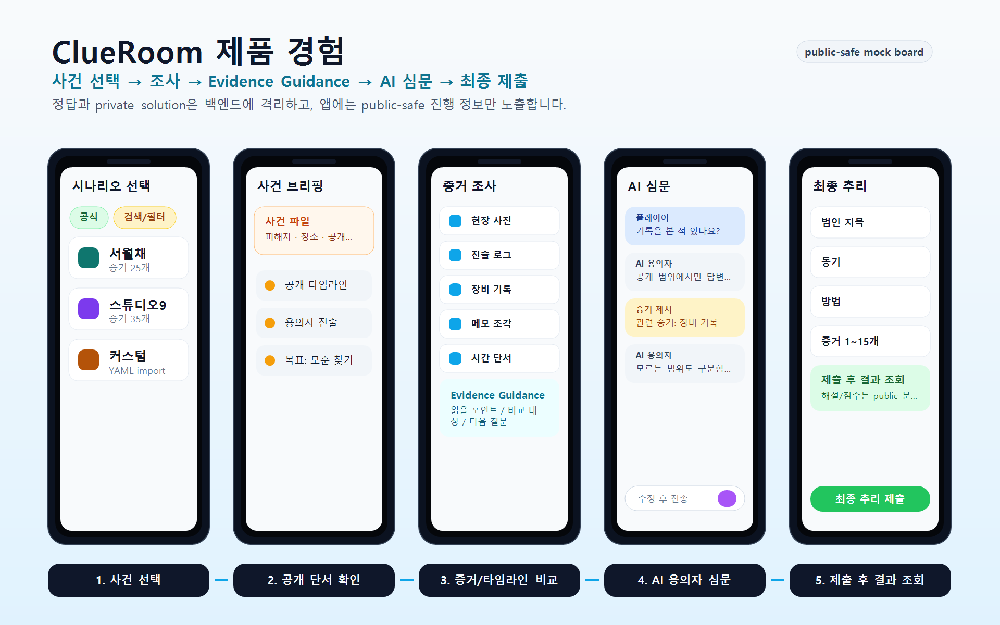
</p>

```text
사건 선택
  -> 사건 브리핑
  -> 증거 / 타임라인 확인
  -> Evidence Guidance
  -> AI 용의자 심문
  -> 최종 추리 제출
  -> 결과 조회
```

백엔드는 위 흐름을 하나의 플레이 세션으로 관리합니다. 앱과 웹은 같은 public API를 호출하고, 정답과 private solution은 서버 경계 안에 격리됩니다.

---

## Backend Highlights

| 영역 | 구현 내용 | 포트폴리오 포인트 |
|---|---|---|
| AI NPC 심문 | 용의자별 공개 정보, 해금 증거, 답변 정책을 조합해 짧은 AI 답변 생성 | LLM을 자유 생성기가 아니라 NPC actor로 제한 |
| 정답 누설 방지 | `Solution`/private seed는 백엔드가 보관하고 AI NPC 심문 prompt에는 범인 정보를 직접 전달하지 않음 | prompt injection과 spoiler metadata를 동시에 방어 |
| Response Policy | `ResponsePolicyResolver`가 현재 질문/증거/상태에 맞는 답변 정책을 결정 | AI가 정책을 판단하지 않도록 서버 rule engine 분리 |
| Scenario YAML Import | 공식 시나리오 YAML을 검증 후 DB에 import하고 content hash로 중복 반영 제어 | 운영 seed 교체와 public/private 경계 관리 |
| Scenario List Performance | QueryDSL 동적 필터, Base64 keyword cache key, `(status, visibility, created_at DESC, id DESC)` 복합 인덱스, Redis 30초 캐시 | 홈 화면 핵심 API를 k6로 측정하고 P95 `241ms -> 19ms`로 개선. [성능 리포트](docs/perf/SCENARIO_LIST_PERFORMANCE_REPORT_2026-06-19.md) |
| Play Runtime | session, evidence unlock, suspect, interrogation, final deduction, result path 관리 | 추리게임 상태 전이를 서버에서 일관되게 보장 |
| Auth | Google/Kakao OAuth, JWT access token, refresh session, web/android 공존 | 모바일 앱과 웹 배포를 함께 지원 |
| AI Quota / Rate Limit | Redis 일일 counter로 계정+시나리오 150회, 계정 전체 350회 실제 AI provider 호출 제한 | 과다 심문은 35/50/70/100/120회 안내 단계로 정리 유도, quota 초과는 `429 / AI_RATE_002`로 차단 |
| Review / Play Count Consistency | 리뷰 평점은 DB 비관적 락, playCount는 쿼리 레벨 atomic update, 북마크는 커밋 후 목록 캐시 무효화 | Lost update 방어, 북마크 정합성 보장, playCount/averageRating은 30초 stale 허용 정책 명시 |
| Ops | Blue-Green 배포, 외부 MySQL/Redis, Loki/Grafana/n8n, Slack alert | 저비용 MVP 환경에서 운영 경험과 복구 절차 확보 |
| LLMOps | `AI_CALL`, `AI_CALL_CONTEXT` 로그로 token, latency, failure/fallback 관측 | 비용과 품질을 raw prompt 없이 운영 지표화 |

---

## Architecture

<p align="center">
  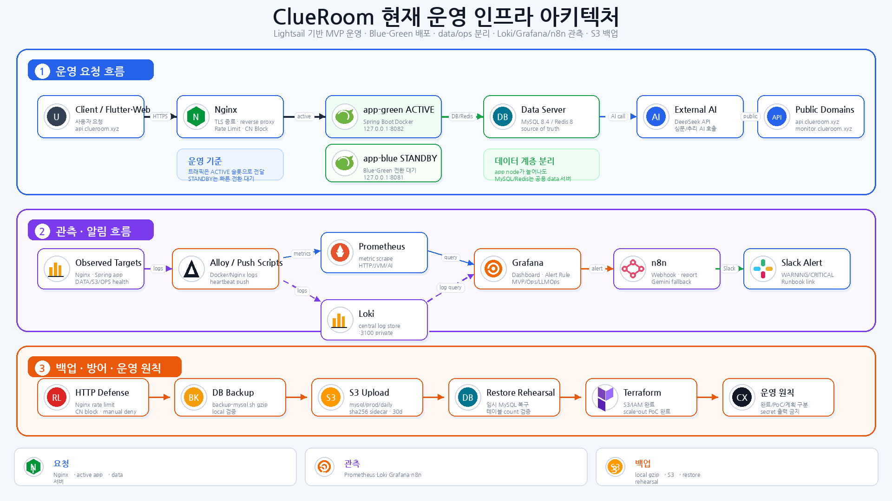
</p>

현재 운영 기준은 저비용 Lightsail 3서버 역할 분리 구조입니다. 더 상세한 서버/백업/관측 흐름 이미지는 [Infra Portfolio Summary](docs/infra/INFRA_PORTFOLIO_SUMMARY.md)에 분리했습니다.

| 서버 | 역할 |
|---|---|
| `clueroom-api-prod-01` | Nginx, Spring Boot app-blue/app-green, Prometheus, Grafana, Alloy |
| `clueroom-data-01` | MySQL 8.4, Redis 8, local backup, S3 DB backup upload, data health |
| `clueroom-ops-01` | Loki, n8n, ops health, Slack alert routing |
| AWS S3 | 이미지 asset, DB backup bucket |
| External AI | DeepSeek compatible API for interrogation/final deduction |

Scale-out은 운영 기준 구조가 아니라, Terraform app node와 수동 Nginx upstream으로 검증한 **PoC**입니다. 결과와 실행 절차는 [POC-006 scale-out manual LB](docs/infra/poc/POC-006-scaleout-manual-lb.md), [Scale-out Runbook](docs/infra/runbook/SCALEOUT_MANUAL_LB_RUNBOOK.md)에 분리했습니다.

PoC 결과 요약:

| 검증 항목 | 결과 |
|---|---|
| App node provisioning | Terraform으로 app01/app02 임시 app node 생성 |
| Runtime sync | prod 제어 스크립트로 app runtime, secret presence, health 확인 |
| Manual LB | local active + app01 + app02를 Nginx equal upstream에 수동 연결 |
| Distribution | 60회 요청이 `21 / 19 / 20`으로 분산 |
| Rollback | local active Blue-Green slot만 남기는 상태로 복구 가능 |

---

## Domain Flow

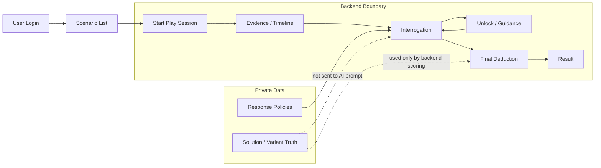

주요 Aggregate는 아래 흐름으로 분리됩니다.

| Aggregate | 책임 |
|---|---|
| Scenario / ScenarioVariant | 공식/커스텀 시나리오, 공개 상태, content hash |
| Suspect / Evidence / Location | 플레이어에게 공개되는 사건 정보 |
| Solution / Secret / ResponsePolicy | private answer, hidden truth, 답변 정책 |
| PlaySession | 사용자별 진행 상태, 해금 상태, 최종 제출 상태 |
| InterrogationLog | AI 심문 요청/응답, latency, token, fallback 상태 |
| FinalDeduction | 범인/동기/방법/은폐 제출과 채점 결과 |
| User / Auth | OAuth provider, refresh session, deviceId, role |
| Review / Bookmark | 계정 기반 시나리오 평가와 저장 |

ERD 상세는 [CaseLab AI ERD Design](docs/CaseLab_AI_ERD_Design.md)을 기준으로 관리합니다.

---

## AI Safety Design

ClueRoom의 AI는 사건의 모든 진실을 아는 “작가”가 아니라, 현재 공개된 정보 안에서만 반응하는 “용의자 NPC”입니다.

```text
Backend knows:
  culprit, motive, method, cover-up, solution, private seed, unlock state

AI receives:
  public suspect profile, currently unlocked evidence,
  selected evidence, server-selected response policy,
  user question, short answer rule
```

핵심 제약:

- AI NPC 심문 prompt에 “너는 범인이다” 또는 전체 정답을 넣지 않습니다.
- 사용자가 증거를 제시해도 서버가 결정한 policy 범위 안에서만 답변합니다.
- 답변은 1~2문장으로 제한합니다.
- 설정에 없는 사실을 새로 만들지 않도록 system/policy prompt를 분리합니다.
- prompt 문자열은 `domain/ai`의 prompt builder와 resources prompt template 중심으로 관리합니다.
- transaction 안에서 외부 AI API를 호출하지 않는 구조를 유지합니다.
- raw prompt, 사용자 질문 전문, AI 답변 전문을 운영 보고서에 남기지 않습니다.

정책 상세는 [AI NPC Prompt Policy](docs/AI_NPC_PROMPT_POLICY.md)를 따릅니다.

---

## API Surface

| 기능 | 대표 API | 설명 |
|---|---|---|
| Auth | `POST /api/auth/oauth`, `POST /api/auth/oauth/kakao/code`, `POST /api/auth/refresh` | Google/Kakao OAuth, JWT 재발급 |
| Scenario | `GET /api/scenarios`, `GET /api/scenarios/{scenarioId}` | 공개 시나리오 목록/상세. keyword/type/difficulty/playTime 조건 검색, Base64 keyword cache key, Redis short TTL cache 적용 |
| Play Session | `POST /api/play-sessions`, `GET /api/play-sessions/{sessionId}` | 플레이 시작과 진행 상태 조회 |
| Evidence | `GET /api/play-sessions/{sessionId}/evidences` | 해금된 증거, guidance, 함께 볼 증거 |
| Suspect | `GET /api/play-sessions/{sessionId}/suspects` | public-safe 용의자 정보 |
| Interrogation | `POST /api/play-sessions/{sessionId}/interrogations` | AI 용의자 심문. 응답에 `aiQuota` 안내 metadata 포함 |
| Final Deduction | `POST /api/play-sessions/{sessionId}/final-deduction` | 최종 추리 제출 |
| Result | `GET /api/play-sessions/{sessionId}/result` | 제출 후 결과 조회 |
| Review / Bookmark | `POST /api/scenarios/{scenarioId}/reviews`, `POST /api/scenarios/{scenarioId}/bookmarks` | 계정 기반 리뷰/북마크 |
| Internal Seed Import | 운영자 전용 scenario YAML import flow | 공식 시나리오 seed 검증/반영. 공개 플레이 API 아님 |

전체 request/response 계약은 [API Spec](docs/CaseLab_AI_API_Spec.md)에서 관리합니다.

---

## LLMOps

ClueRoom은 AI 기능을 “잘 동작한다” 수준에서 끝내지 않고, 호출 수·비용·지연·실패율을 운영 지표로 분리했습니다.

| 로그 | 목적 |
|---|---|
| `AI_CALL` | featureType, promptVersion, model, latency, token, success/failure/fallback 관측 |
| `AI_CALL_CONTEXT` | system/policy/npc/evidence/history/question block별 token estimate 관측 |
| `AI_QUOTA_BLOCK` / `ai.quota.blocks` | Redis counter로 실제 provider 호출 전 차단된 요청을 provider failure와 분리해 기록. quota 초과/Redis 장애를 `AI_RATE_002`/`AI_RATE_003`으로 명확히 분리 |
| LLMOps Light Monitor | 최근 window 기준 Slack alert |
| Codex Handoff Report | 사람이 필요할 때 raw-free 집계 리포트를 Codex에 전달해 분석 |

<p align="center">
  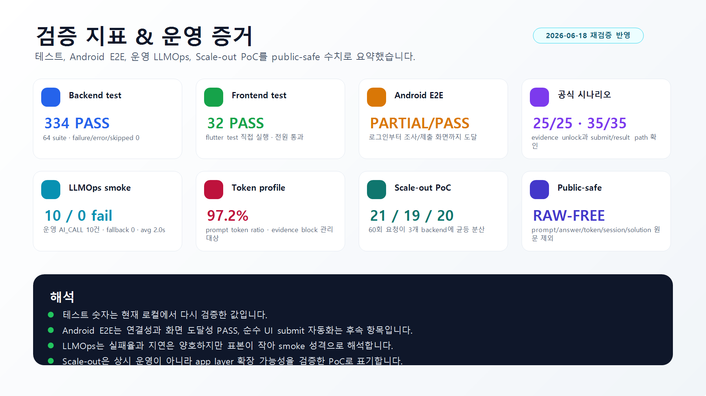
</p>

비용 계획과 rate-limit 정책은 [LLMOps 비용·레이트리밋 계획](docs/infra/agent/LLMOPS_COST_AND_RATE_LIMIT_PLAN_2026-06-17.md)에 정리했습니다.
핵심 결론은 `INTERROGATION / npc_interrogation_v1`이 비용을 지배하고, token 대부분이 completion이 아니라 evidence/history prompt context에서 발생한다는 점입니다. 운영 기본값은 계정+시나리오별 150회, 계정 전체 350회이며, 35/50/70/100/120회 구간에서 증거 정리·후보 비교·최종 추리를 유도합니다.

---

## Reliability & QA

<p align="center">
  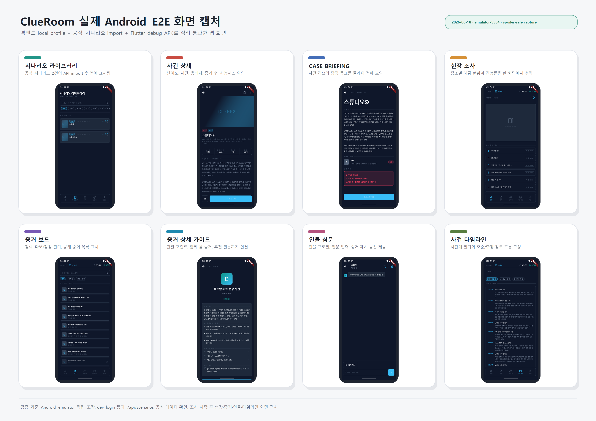
</p>

QA는 blind 조건과 public/private 경계를 분리해서 운영합니다.

| 기준 | 원칙 |
|---|---|
| Public report | 점수, 정답성, 범인명, raw session/token, 사용자 질문/AI 답변 원문 제외 |
| Blind QA | private seed, solution, 이전 정답 보고서 열람 금지 |
| API-only QA | spoiler metadata masking 기록 없으면 blind 판단으로 사용하지 않음 |
| Web QA | production API write 여부와 QA 승인 상태 기록 |
| Android/Web | 같은 backend API 계약으로 동작하되 surface별 UX 이슈를 분리 기록 |

최근 public-safe 검증 문서:

| 문서 | 확인한 내용 |
|---|---|
| [Android E2E Local Retest 2026-06-18](docs/qa/archive/QA_ANDROID_E2E_LOCAL_RETEST_REPORT_2026-06-18.md) | 로그인, 라이브러리, 상세, 브리핑, 조사 탭, 심문, 제출 화면 도달. 공식 시나리오 `25/25`, `35/35` evidence reachability |
| [Web E2E QA 2026-06-19](docs/qa/archive/QA_WEB_E2E_REPORT_2026-06-19.md) | 웹 로그인, 시나리오 진입, 심문, 최종 제출/result path targeted retest PASS. 모바일 scenario detail CTA 이슈는 QA board에서 추적 |
| [Web Production PR #7 Smoke 2026-06-20](docs/qa/archive/QA_WEB_PROD_PR7_SMOKE_REPORT_2026-06-20.md) | 운영 웹에서 공개 QA 로그인 숨김, Google/Kakao 버튼, 북마크 서버 persistence, 저장한 사건 목록, core play smoke PASS. 리뷰 성공 경로와 access-expiry refresh retry는 PARTIAL로 기록 |
| [LLMOps Daily Report 2026-06-19](docs/infra/agent/LLMOPS_DAILY_REPORT_2026-06-19.md) | 운영 provider window `AI_CALL` 95건, success/failure/fallback `95/0/0`. 웹 QA가 섞인 표본이라 organic traffic으로 해석하지 않음 |
| [Scale-out PoC 2026-06-12](docs/infra/poc/POC-006-scaleout-manual-lb.md) | 수동 Nginx LB equal mode, 60회 요청 `21/19/20` 분산, rollback 기준 |

정본 QA 지침은 [QA Operating Guide](docs/QA_OPERATING_GUIDE.md)를 기준으로 합니다.

---

## Proof Snapshot

| Backend Test | Scenario Coverage | Scenario API Perf | LLMOps QA Window | Scale-out PoC | Web Prod Smoke |
|---:|---:|---:|---:|---:|---:|
| **345 PASS** | **25/25 · 35/35** evidence reachability | P95 **241ms -> 19ms** | QA-window **95 / 0 / 0**, organic 분리 필요 | **21 / 19 / 20** over 60 requests | core flow **PASS**, release gates tracked |

> 수치는 public-safe QA/LLMOps/PoC 보고서 기준입니다. 정답, 점수, session/token, raw prompt/answer는 공개 README에 포함하지 않습니다.
> LLMOps 95건 window는 2026-06-19 웹 QA 활동이 섞인 provider 표본입니다. organic production traffic 평균으로 과장하지 않습니다.

## Visual Evidence

<table>
  <tr>
    <td width="50%">
      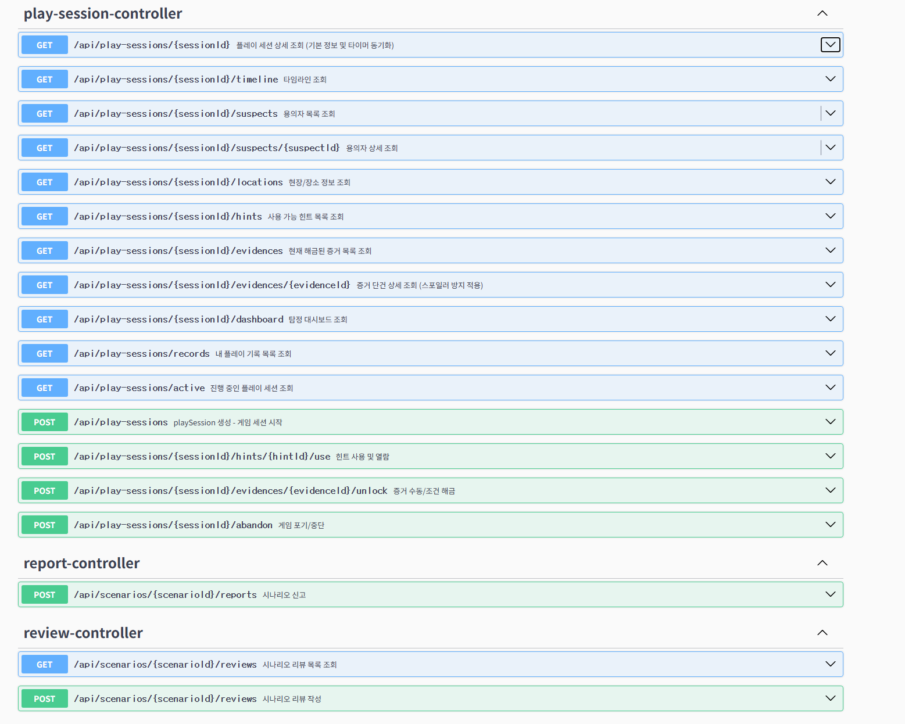
      <br>
      <sub>Swagger 기준 play-session API 표면. 세션, 증거, 심문, 최종 추리 흐름이 하나의 런타임 API로 연결됩니다.</sub>
    </td>
    <td width="50%">
      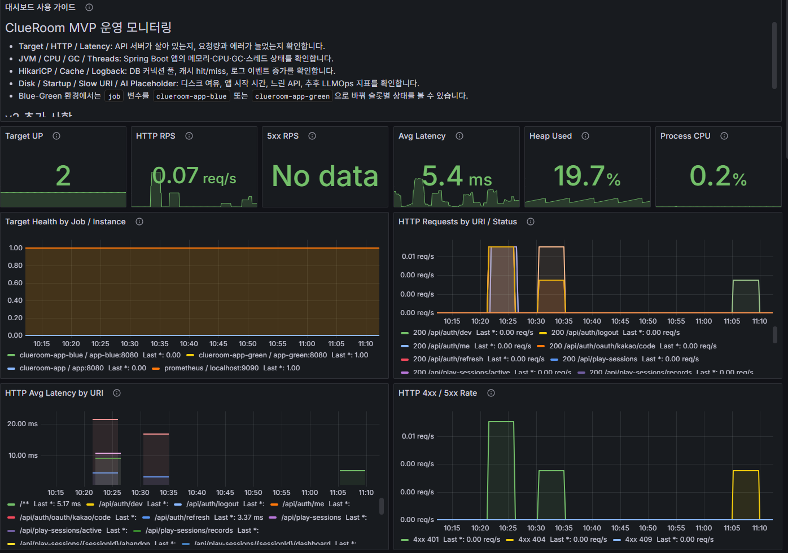
      <br>
      <sub>운영 대시보드. Target health, HTTP RPS, 5xx, latency, heap, CPU를 Grafana에서 관측합니다.</sub>
    </td>
  </tr>
  <tr>
    <td width="50%">
      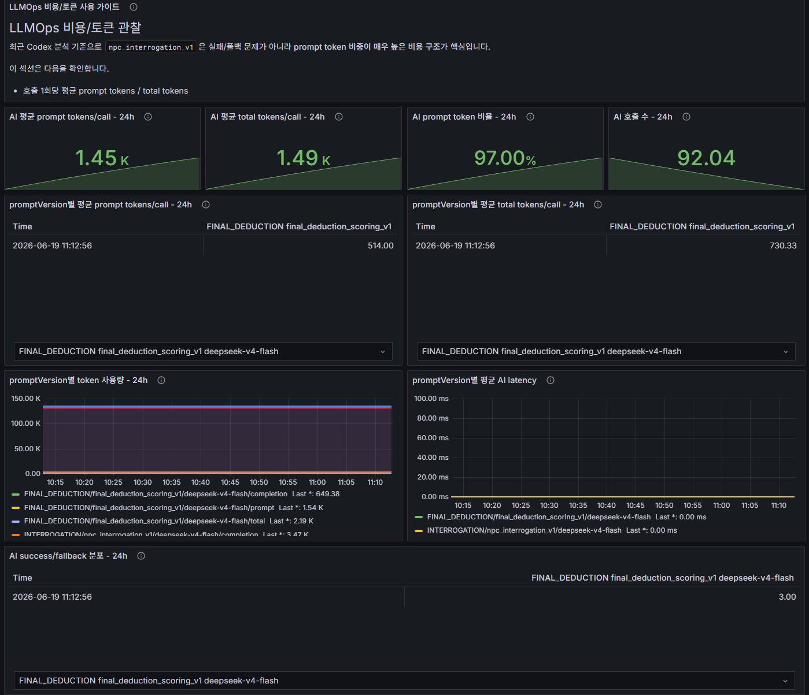
      <br>
      <sub>LLMOps 비용 관찰. prompt token 비율, tokens/call, feature별 token 사용량을 raw prompt 없이 추적합니다. 스크린샷은 운영 대시보드 예시이며 Proof Snapshot과 기준 시점이 다를 수 있습니다.</sub>
    </td>
    <td width="50%">
      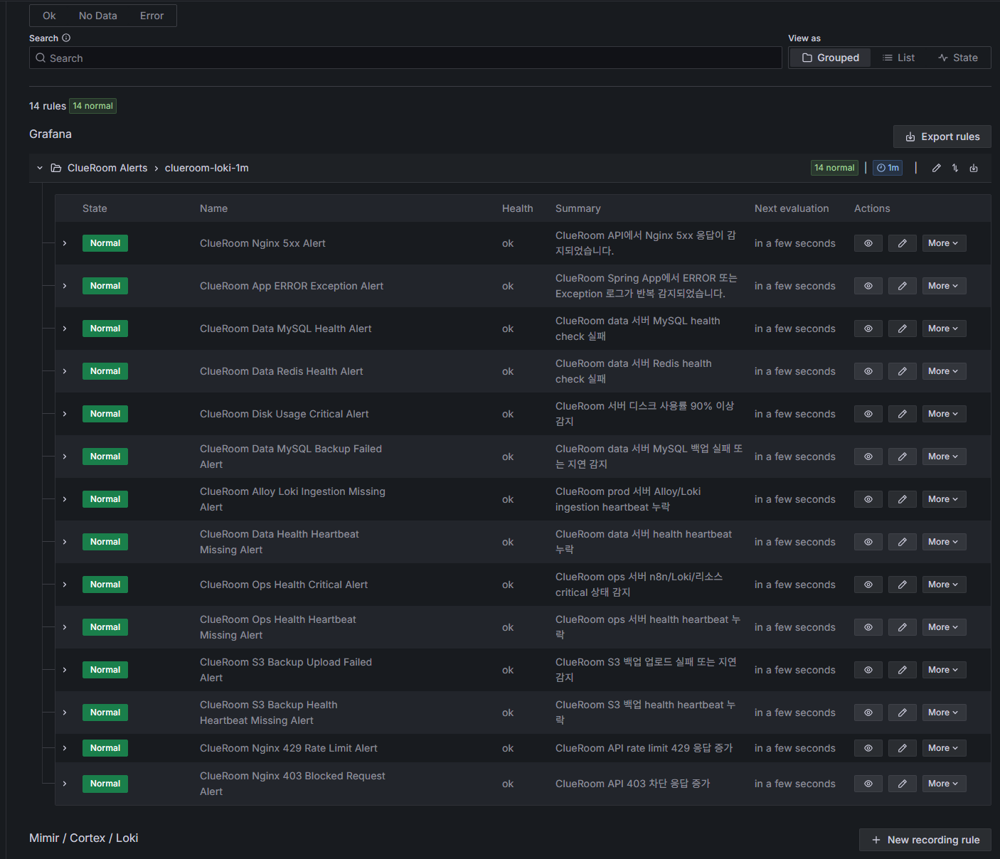
      <br>
      <sub>Grafana alert rules. Nginx, app error, DB/Redis, backup, Loki ingestion, 403/429 방어 이벤트를 알림 룰로 관리합니다.</sub>
    </td>
  </tr>
  <tr>
    <td colspan="2">
      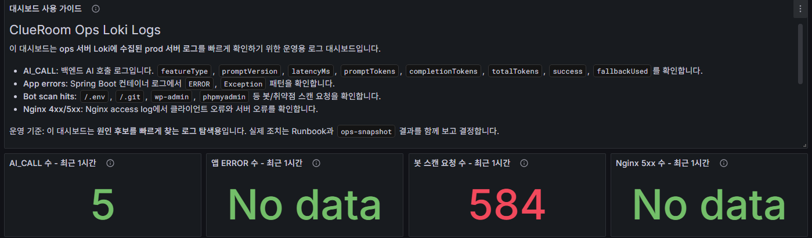
      <br>
      <sub>운영 로그 탐색 대시보드. 봇 스캔 요청 급증을 Loki에서 분리해 확인하고, 같은 window에서 app error와 Nginx 5xx를 함께 봅니다.</sub>
    </td>
  </tr>
</table>

---

## Metric Charts

아래 차트는 public-safe 문서에 남긴 집계 수치만 사용합니다. 원문 prompt, AI 답변, 사용자 질문, session/token, 정답성 정보는 포함하지 않습니다.

<table>
  <tr>
    <td width="50%">
      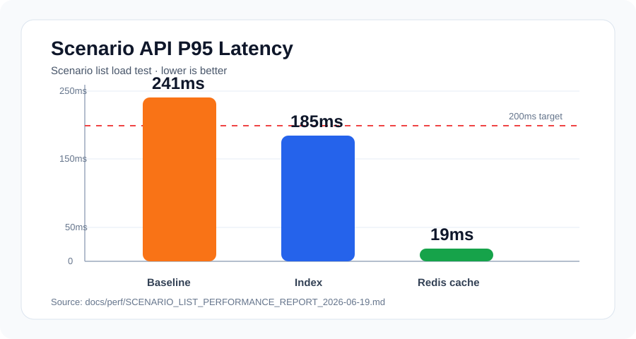
      <br>
      <sub>시나리오 목록 API는 복합 인덱스, 충돌 방지 cache key, Redis short TTL cache 적용 후 P95가 241ms에서 19ms로 내려갔습니다.</sub>
    </td>
    <td width="50%">
      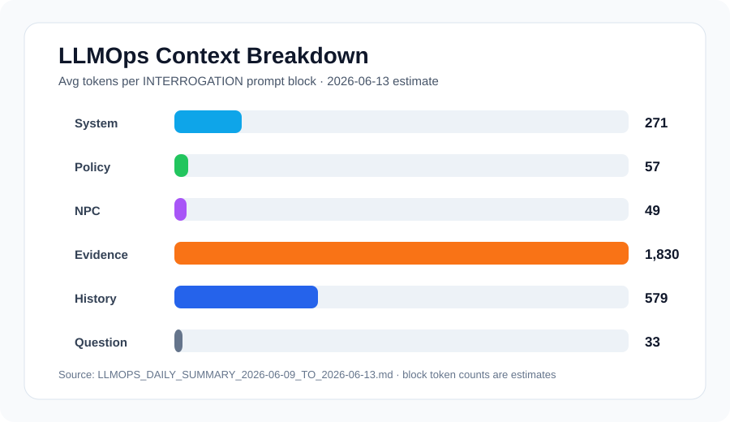
      <br>
      <sub>LLMOps 집계에서는 심문 비용의 병목이 completion이 아니라 evidence/history prompt context임을 확인했습니다. block token은 estimate 기준입니다.</sub>
    </td>
  </tr>
  <tr>
    <td width="50%">
      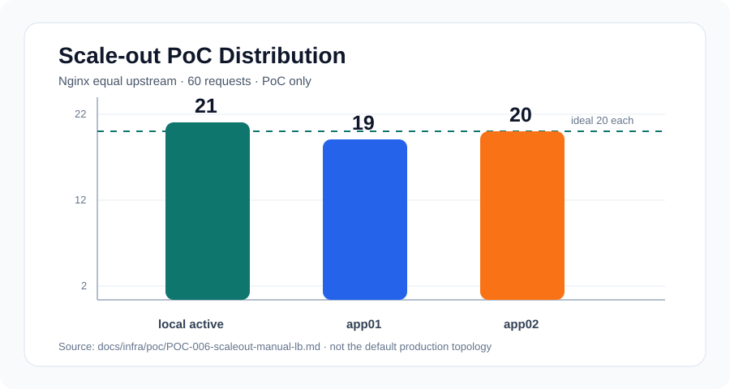
      <br>
      <sub>Scale-out은 운영 기본 구조가 아니라 PoC입니다. Terraform app node 2대와 local active slot을 Nginx equal upstream으로 묶어 60회 요청 분산을 확인했습니다.</sub>
    </td>
    <td width="50%">
      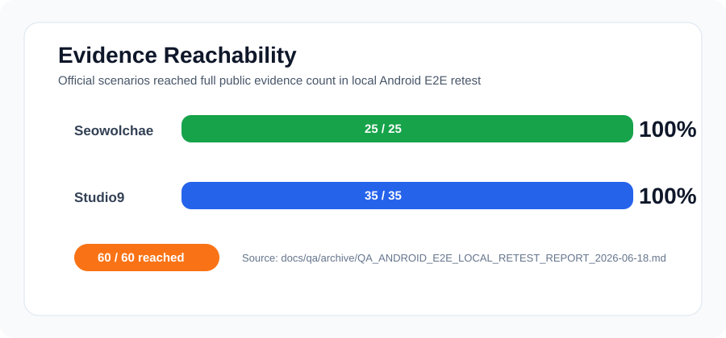
      <br>
      <sub>Android E2E local retest에서 두 공식 시나리오 모두 public evidence reachability를 끝까지 확인했습니다.</sub>
    </td>
  </tr>
</table>

---

## Ops Automation Evidence

운영 알림은 단순히 "문제가 생겼다"를 보내는 데서 끝나지 않고, Codex가 읽을 수 있는 형태의 handoff report로 정리합니다. 아래 캡처는 public-safe 집계와 운영 상태만 포함하며 secret 값, raw token, raw prompt/answer는 포함하지 않습니다.

<table>
  <tr>
    <td width="50%">
      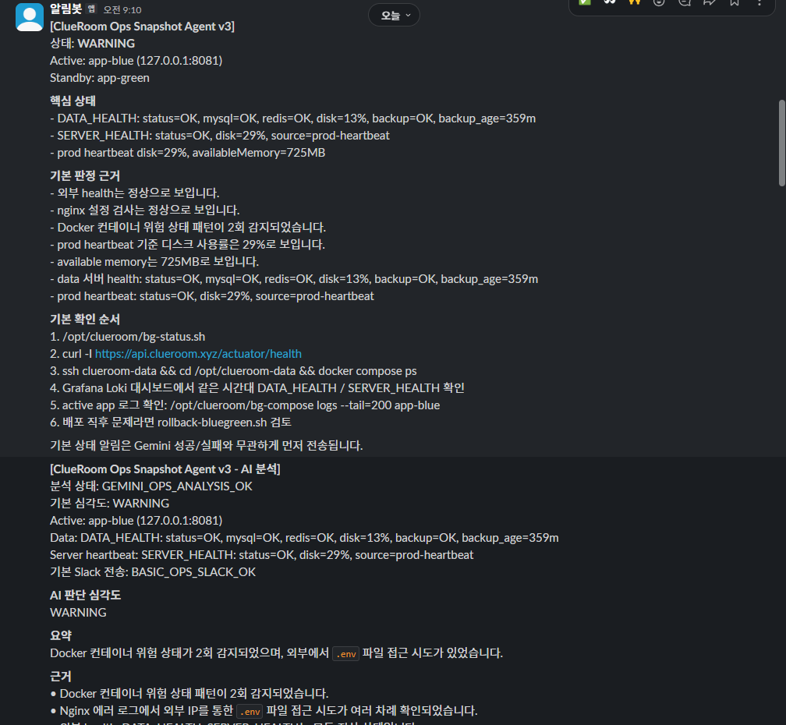
      <br>
      <sub>Ops Snapshot Agent. active slot, data/server health, disk/memory, backup age, suspicious request pattern을 Slack으로 요약하고 기본 확인 순서를 함께 전달합니다.</sub>
    </td>
    <td width="50%">
      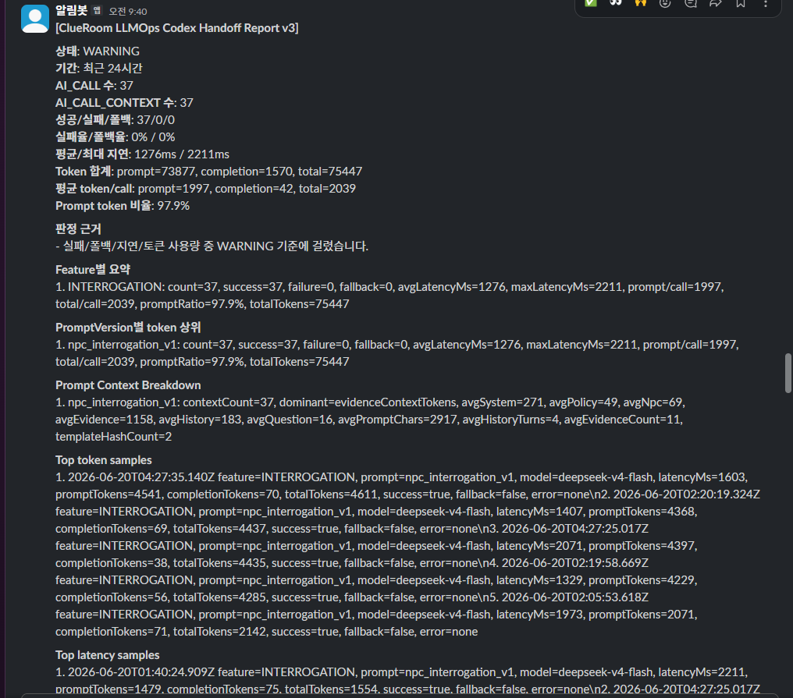
      <br>
      <sub>LLMOps Codex Handoff. AI_CALL/AI_CALL_CONTEXT 집계를 기반으로 feature별 latency, token/call, prompt ratio, context breakdown을 raw-free 형태로 전달합니다.</sub>
    </td>
  </tr>
</table>

---

## Tech Stack

| Category | Stack |
|---|---|
| Language | Java 21 |
| Framework | Spring Boot 4.0.6, Spring MVC, Spring Security, Spring Data JPA |
| AI | Spring AI, OpenAI-compatible DeepSeek API |
| Database | MySQL 8.4, H2 test profile |
| Query | QueryDSL 5.1.0 |
| Cache / Lock | Redis 8, Redisson |
| Auth | JWT, Google OAuth, Kakao OAuth, refresh session |
| Observability | Spring Actuator, Micrometer, Prometheus, Grafana, Loki, Alloy |
| Infra | Docker Compose, Nginx, Certbot, AWS Lightsail, AWS S3 |
| Notification | Firebase Admin SDK, Slack alert via n8n |
| Test | JUnit 5, Spring Boot Test, WebMVC Test, k6 |
| Docs | Markdown, Mermaid, public-safe QA/LLMOps reports |

---

## Run Locally

```bash
./gradlew test
./gradlew bootJar
bash scripts/compose-up.sh
```

종료:

```bash
bash scripts/compose-down.sh
```

로컬 기본 URL:

| 대상 | URL |
|---|---|
| API | `http://localhost:8080` |
| Swagger | `http://localhost:8080/swagger-ui.html` |
| Actuator Health | `http://localhost:8080/actuator/health` |
| Prometheus | `http://localhost:9090` |
| Grafana | `http://localhost:3000` |

Android Emulator에서 로컬 백엔드를 호출할 때는 `http://10.0.2.2:8080`을 사용합니다.

운영 secret, OAuth key, AI key, DB password는 Git에 포함하지 않습니다. 실행/배포 상세는 [Run and Deploy](docs/RUN_AND_DEPLOY.md), 운영 절차는 [Ops Runbook](docs/infra/OPS_RUNBOOK.md)을 따릅니다.

시나리오 목록 API 부하 테스트는 로컬 백엔드 실행 후 선택적으로 수행합니다.

```bash
k6 run scripts/k6/scenario-list-load-test.js
```

---

## Repository Map

```text
src/main/java/com/startup
  common/          공통 config, auth, dto, error, entity, util
  domain/
    ai/            AI 심문, 최종추리, prompt, LLM client, telemetry
    auth/          OAuth/JWT/refresh session
    play/          play session, evidence unlock, final deduction
    scenario/      scenario CRUD, YAML importer, official/custom scenario
    community/     review, bookmark
    notification/  FCM notification
  infrastructure/  외부 시스템 연동

docs/
  db/migrations/  운영 DB 보강 SQL, 성능 인덱스
  infra/           운영 인프라, runbook, LLMOps, scale-out PoC
  frontend/        앱/웹 화면 흐름과 API mapping
  qa/archive/      public-safe QA history
  scenarios/       scenario YAML schema

scripts/
  k6/              시나리오 목록 API 부하 테스트
```

전체 문서 지도는 [docs/README.md](docs/README.md)를 확인하세요.

### Recommended Deep Dives

시간이 부족하면 아래 문서만 보면 ClueRoom 백엔드의 차별점을 빠르게 확인할 수 있습니다.

| 주제 | 문서 |
|---|---|
| AI가 정답을 받지 않는 구조 | [AI NPC Prompt Policy](docs/AI_NPC_PROMPT_POLICY.md) |
| API와 도메인 경계 | [API Spec](docs/CaseLab_AI_API_Spec.md), [ERD Design](docs/CaseLab_AI_ERD_Design.md) |
| 운영 인프라 | [Infrastructure Strategy](docs/infra/CLUEROOM_INFRASTRUCTURE_STRATEGY.md), [Ops Runbook](docs/infra/OPS_RUNBOOK.md) |
| 시나리오 목록 성능 개선 | [Performance report](docs/perf/SCENARIO_LIST_PERFORMANCE_REPORT_2026-06-19.md), [k6 load test](scripts/k6/scenario-list-load-test.js), [scenario list index migration](docs/db/migrations/20260618_add_scenario_list_index.sql) |
| LLMOps 비용과 rate limit | [LLMOps Cost & Rate Limit Plan](docs/infra/agent/LLMOPS_COST_AND_RATE_LIMIT_PLAN_2026-06-17.md) |
| QA와 public-safe 보고 기준 | [QA Operating Guide](docs/QA_OPERATING_GUIDE.md) |
| Scale-out 검증 | [Scale-out PoC](docs/infra/poc/POC-006-scaleout-manual-lb.md), [Scale-out Runbook](docs/infra/runbook/SCALEOUT_MANUAL_LB_RUNBOOK.md) |

<details>
<summary>Reference documents</summary>

| 문서 | 역할 |
|---|---|
| [CLAUDE.md](CLAUDE.md) | 프로젝트 전체 컨텍스트와 작업 규칙 |
| [AGENTS.md](AGENTS.md) | Codex 리뷰 기준 |
| [docs/CaseLab_AI_PRD.md](docs/CaseLab_AI_PRD.md) | 제품 요구사항과 MVP 범위 |
| [docs/CaseLab_AI_API_Spec.md](docs/CaseLab_AI_API_Spec.md) | API request/response 계약 |
| [docs/frontend/CLUEROOM_APP_FLOW_API_GUIDE.md](docs/frontend/CLUEROOM_APP_FLOW_API_GUIDE.md) | Android/Web 화면 흐름과 API mapping |
| [docs/CaseLab_AI_ERD_Design.md](docs/CaseLab_AI_ERD_Design.md) | ERD와 엔티티 관계 |
| [docs/AI_NPC_PROMPT_POLICY.md](docs/AI_NPC_PROMPT_POLICY.md) | AI NPC prompt와 정답 누설 방지 정책 |
| [docs/BACKEND_IMPLEMENTATION_GUIDE.md](docs/BACKEND_IMPLEMENTATION_GUIDE.md) | 백엔드 구현 규칙 |
| [docs/RUN_AND_DEPLOY.md](docs/RUN_AND_DEPLOY.md) | 로컬 실행과 배포 요약 |
| [docs/infra/OPS_RUNBOOK.md](docs/infra/OPS_RUNBOOK.md) | 운영 명령어, rollback, 백업/복구 |
| [docs/infra/SECURITY_TRAFFIC_ALERT_POLICY.md](docs/infra/SECURITY_TRAFFIC_ALERT_POLICY.md) | 보안, 트래픽, alert 정책 |
| [docs/scenarios/SCENARIO_YAML_SCHEMA.md](docs/scenarios/SCENARIO_YAML_SCHEMA.md) | 시나리오 YAML schema와 private/public 경계 |

</details>

---

## Why This Backend Matters

ClueRoom 백엔드는 단순 CRUD API가 아니라, 추리게임의 상태 전이와 AI 안전성을 함께 다루는 서버입니다.

- 플레이어에게는 충분히 자연스러운 AI 심문 경험을 제공해야 합니다.
- 동시에 AI에게 정답을 직접 알려주지 않아야 합니다.
- 운영에서는 prompt token 비용, 실패율, 지연시간을 감시해야 합니다.
- 배포는 Blue-Green으로 안정성을 확보하고, data/ops 역할을 분리해야 합니다.
- QA 보고서는 public-safe해야 하며, 정답성 신호를 공개 문서에 남기지 않아야 합니다.

이 저장소는 그 균형을 맞추기 위한 백엔드 설계, 운영 문서, 검증 보고서를 함께 관리합니다.
