```mermaid
erDiagram
    USERS {
        bigint id PK
        varchar email UK
        varchar password
        varchar nickname
        varchar profile_image_url
        varchar role
        datetime created_at
        datetime updated_at
    }

    SCENARIOS {
        bigint id PK
        bigint creator_id FK
        varchar title
        text description
        text synopsis
        varchar cover_asset_key
        varchar map_asset_key
        integer content_version
        varchar content_hash
        varchar scenario_type
        varchar visibility
        varchar status
        varchar difficulty
        int player_count_min
        int player_count_max
        int estimated_play_time_minutes
        int play_count
        decimal average_rating
        int rating_count
        int price_credit
        datetime created_at
        datetime updated_at
        datetime published_at
    }

    SCENARIO_VERSIONS {
        bigint id PK
        bigint scenario_id FK
        int version_number
        text case_graph_json
        text change_note
        boolean is_active
        datetime created_at
    }

    SCENARIO_LOCATIONS {
        bigint id PK
        bigint scenario_id FK
        varchar name
        text description
        int map_x
        int map_y
        int sort_order
        datetime created_at
    }

    VICTIMS {
        bigint id PK
        bigint scenario_id FK
        bigint found_location_id FK
        varchar name
        int age
        varchar role
        text description
        varchar cause_of_death
        text found_condition
        datetime created_at
    }

    SUSPECTS {
        bigint id PK
        bigint scenario_id FK
        varchar name
        varchar role
        varchar relation_to_victim
        text public_profile
        text public_statement
        text alibi
        text personality_prompt
        text response_policy_json
        int suspicion_level
        int sort_order
        datetime created_at
        datetime updated_at
    }

    SUSPECT_SECRETS {
        bigint id PK
        bigint suspect_id FK
        varchar title
        text content
        varchar secret_level
        text unlock_condition_json
        boolean is_core_secret
        datetime created_at
    }

    SUSPECT_RESPONSE_POLICIES {
        bigint id PK
        bigint suspect_id FK
        varchar condition_key
        varchar user_intent
        text policy_text
        int priority
        datetime created_at
    }

    EVIDENCES {
        bigint id PK
        bigint scenario_id FK
        bigint location_id FK
        varchar title
        text description
        varchar evidence_type
        varchar importance
        varchar image_url
        boolean is_initial_public
        varchar unlock_type
        text unlock_condition_json
        int unlock_after_minutes
        int sort_order
        datetime created_at
    }

    EVIDENCE_SUSPECTS {
        bigint id PK
        bigint evidence_id FK
        bigint suspect_id FK
        varchar relation_type
        datetime created_at
    }

    HINTS {
        bigint id PK
        bigint scenario_id FK
        int hint_level
        text content
        int unlock_after_minutes
        int penalty_score
        datetime created_at
    }

    TIMELINE_EVENTS {
        bigint id PK
        bigint scenario_id FK
        bigint related_suspect_id FK
        bigint related_evidence_id FK
        varchar event_time
        int event_order
        varchar title
        text description
        varchar event_type
        boolean is_true_event
        varchar visibility
        datetime created_at
    }

    SOLUTIONS {
        bigint id PK
        bigint scenario_id FK
        bigint culprit_suspect_id FK
        text motive
        text method
        text cover_up
        text full_explanation
        datetime created_at
    }

    SOLUTION_EVIDENCES {
        bigint id PK
        bigint solution_id FK
        bigint evidence_id FK
        text reason
        datetime created_at
    }

    PLAY_SESSIONS {
        bigint id PK
        bigint user_id FK
        bigint scenario_id FK
        bigint scenario_variant_id FK
        varchar status
        datetime started_at
        datetime ended_at
        int current_elapsed_seconds
        int score
        varchar grade
        int hint_count
        int interrogation_count
        datetime created_at
        datetime updated_at
    }

    UNLOCKED_EVIDENCES {
        bigint id PK
        bigint play_session_id FK
        bigint evidence_id FK
        varchar unlocked_reason
        datetime unlocked_at
    }

    USED_HINTS {
        bigint id PK
        bigint play_session_id FK
        bigint hint_id FK
        datetime used_at
    }

    INTERROGATION_LOGS {
        bigint id PK
        bigint play_session_id FK
        bigint suspect_id FK
        bigint presented_evidence_id FK
        varchar question_type
        text question
        text answer
        varchar ai_model
        datetime created_at
    }

    FINAL_DEDUCTIONS {
        bigint id PK
        bigint play_session_id FK
        bigint selected_culprit_id FK
        text motive_text
        text method_text
        text cover_up_text
        int score
        varchar grade
        text feedback
        datetime submitted_at
    }

    FINAL_DEDUCTION_EVIDENCES {
        bigint id PK
        bigint final_deduction_id FK
        bigint evidence_id FK
        datetime created_at
    }

    SCENARIO_REVIEWS {
        bigint id PK
        bigint scenario_id FK
        bigint user_id FK
        int rating
        text content
        boolean is_spoiler
        datetime created_at
        datetime updated_at
    }

    SCENARIO_BOOKMARKS {
        bigint id PK
        bigint scenario_id FK
        bigint user_id FK
        datetime created_at
    }

    SCENARIO_REPORTS {
        bigint id PK
        bigint scenario_id FK
        bigint reporter_id FK
        varchar reason
        text detail
        varchar status
        datetime created_at
        datetime processed_at
    }

    TAGS {
        bigint id PK
        varchar name UK
        datetime created_at
    }

    SCENARIO_TAGS {
        bigint id PK
        bigint scenario_id FK
        bigint tag_id FK
        datetime created_at
    }

    SCENARIO_VALIDATION_RESULTS {
        bigint id PK
        bigint scenario_id FK
        varchar validation_status
        int validation_score
        text problem_summary
        text suggestion
        datetime checked_at
    }

    AI_GENERATION_LOGS {
        bigint id PK
        bigint user_id FK
        bigint scenario_id FK
        varchar request_type
        varchar model_name
        text prompt_summary
        varchar result_status
        int input_tokens
        int output_tokens
        int cost_credit
        datetime created_at
    }

    CREDIT_WALLETS {
        bigint id PK
        bigint user_id FK
        int balance
        bigint version
        datetime created_at
        datetime updated_at
    }

    CREDIT_TRANSACTIONS {
        bigint id PK
        bigint user_id FK
        bigint wallet_id FK
        int amount
        varchar transaction_type
        varchar reference_type
        bigint reference_id
        int balance_after
        datetime created_at
    }

    SCENARIO_PURCHASES {
        bigint id PK
        bigint user_id FK
        bigint scenario_id FK
        int price_credit
        varchar status
        datetime purchased_at
        datetime refunded_at
    }

    SCENARIO_ACCESSES {
        bigint id PK
        bigint user_id FK
        bigint scenario_id FK
        varchar access_type
        bigint purchase_id FK
        datetime granted_at
        datetime revoked_at
    }

    USERS ||--o{ SCENARIOS : creates
    USERS ||--o{ PLAY_SESSIONS : plays
    USERS ||--o{ SCENARIO_REVIEWS : writes
    USERS ||--o{ SCENARIO_BOOKMARKS : bookmarks
    USERS ||--o{ SCENARIO_REPORTS : reports
    USERS ||--o{ AI_GENERATION_LOGS : requests

    SCENARIOS ||--o{ SCENARIO_VERSIONS : has
    SCENARIOS ||--o{ SCENARIO_LOCATIONS : has
    SCENARIOS ||--o{ VICTIMS : has
    SCENARIOS ||--o{ SUSPECTS : has
    SCENARIOS ||--o{ EVIDENCES : has
    SCENARIOS ||--o{ HINTS : has
    SCENARIOS ||--o{ TIMELINE_EVENTS : has
    SCENARIOS ||--|| SOLUTIONS : has
    SCENARIOS ||--o{ PLAY_SESSIONS : starts
    SCENARIOS ||--o{ SCENARIO_REVIEWS : receives
    SCENARIOS ||--o{ SCENARIO_BOOKMARKS : receives
    SCENARIOS ||--o{ SCENARIO_REPORTS : receives
    SCENARIOS ||--o{ SCENARIO_VALIDATION_RESULTS : validated_by
    SCENARIOS ||--o{ AI_GENERATION_LOGS : logs

    SCENARIO_LOCATIONS ||--o{ EVIDENCES : contains
    SCENARIO_LOCATIONS ||--o{ VICTIMS : found_at

    SUSPECTS ||--o{ SUSPECT_SECRETS : has
    SUSPECTS ||--o{ SUSPECT_RESPONSE_POLICIES : has
    SUSPECTS ||--o{ INTERROGATION_LOGS : questioned_in
    SUSPECTS ||--o{ TIMELINE_EVENTS : related_to
    SUSPECTS ||--o{ SOLUTIONS : culprit
    SUSPECTS ||--o{ FINAL_DEDUCTIONS : selected_as

    EVIDENCES ||--o{ EVIDENCE_SUSPECTS : links
    SUSPECTS ||--o{ EVIDENCE_SUSPECTS : links
    EVIDENCES ||--o{ UNLOCKED_EVIDENCES : unlocked_as
    EVIDENCES ||--o{ INTERROGATION_LOGS : presented_in
    EVIDENCES ||--o{ TIMELINE_EVENTS : related_to
    EVIDENCES ||--o{ SOLUTION_EVIDENCES : proves
    EVIDENCES ||--o{ FINAL_DEDUCTION_EVIDENCES : selected_in

    SOLUTIONS ||--o{ SOLUTION_EVIDENCES : requires

    PLAY_SESSIONS ||--o{ UNLOCKED_EVIDENCES : unlocks
    PLAY_SESSIONS ||--o{ USED_HINTS : uses
    PLAY_SESSIONS ||--o{ INTERROGATION_LOGS : records
    PLAY_SESSIONS ||--|| FINAL_DEDUCTIONS : submits

    HINTS ||--o{ USED_HINTS : used_as

    FINAL_DEDUCTIONS ||--o{ FINAL_DEDUCTION_EVIDENCES : includes

    SCENARIOS ||--o{ SCENARIO_TAGS : tagged
    TAGS ||--o{ SCENARIO_TAGS : used_by

    USERS ||--|| CREDIT_WALLETS : owns
    USERS ||--o{ CREDIT_TRANSACTIONS : has
    CREDIT_WALLETS ||--o{ CREDIT_TRANSACTIONS : records
    USERS ||--o{ SCENARIO_PURCHASES : purchases
    SCENARIOS ||--o{ SCENARIO_PURCHASES : purchased_as
    USERS ||--o{ SCENARIO_ACCESSES : granted
    SCENARIOS ||--o{ SCENARIO_ACCESSES : accessible_by
    SCENARIO_PURCHASES ||--o| SCENARIO_ACCESSES : grants
```

# CaseLab AI ERD 설계

이 문서는 `추리게임.sql`을 기준으로 CaseLab AI의 ERD를 단계적으로 정리한다.

진행 순서:

```text
1단계: 필요한 엔티티 목록 도출
2단계: 엔티티 간 관계 정의
3단계: 엔티티 속성 정의와 동시성 제어 지점 표시
4단계: Mermaid ERD 코드 작성
5단계: 비판적 코드리뷰 관점 검토
```

현재 문서는 5단계까지 작성한다.

---

## 0. 코드 SoT 동기화 노트

이 문서는 초기 ERD 설계와 구현 후보를 함께 포함한다.
현재 `develop` 코드 기준으로 아래 항목은 구현 상태가 다르므로, 새 구현이나 migration 작성 시 코드 SoT를 우선한다.

| 문서상 항목 | 현재 코드 SoT |
|---|---|
| `ScenarioVersion` | JPA 엔티티 없음. 버전은 `Scenario.contentVersion`, `Scenario.contentHash` 인라인 컬럼으로 관리한다. |
| `Tag` / `ScenarioTag` | JPA 엔티티 없음. 검색/필터 확장 후보로 본다. |
| `SuspectSecret` | JPA 엔티티 없음. NPC 지식 경계는 `NpcKnowledgeProfile`이 담당한다. |
| `SolutionEvidence` | JPA 엔티티 없음. 핵심 증거는 `Solution.keyEvidenceIds` 문자열 컬럼을 파싱해 사용한다. |
| `AiGenerationLog` | JPA 엔티티 없음. AI 호출 로그는 `AiCallRecorder`/`AiCallLogWriter`가 `ai_call_logs`에 raw JDBC로 기록한다. |
| 누락된 구현 엔티티 | `ScenarioVariant`, `VariantSolution`, `EvidenceVariantState`, `EvidenceUnlockRule`, `ScenarioAsset`, `NpcKnowledgeProfile`이 코드에 존재한다. |
| asset URL | `thumbnail_url` 중심이 아니라 `coverAssetKey`, `mapAssetKey`, `imageAssetKey`, `portraitAssetKey`를 URL resolver로 변환한다. |

아래 본문에서 위 항목이 별도 엔티티처럼 설명되더라도, 현재 구현 기준으로는 이 표를 우선한다.

---

## 1단계. 필요한 엔티티 목록

### 1. 사용자 / 계정

| 엔티티 | 설명 |
|---|---|
| User | 서비스 사용자. 시나리오 제작자, 플레이어, 리뷰 작성자, 신고자 역할을 모두 가질 수 있다. |

현재 SQL 기준으로 `users` 테이블이 존재한다.  
초기 MVP에서는 `MockUserProvider`로 `MOCK_USER_ID=1`을 사용하더라도, `play_sessions`, `scenarios`, `reviews`, `bookmarks`에는 `user_id` 또는 `creator_id`를 유지해야 한다.

---

### 2. 시나리오 핵심

| 엔티티 | 설명 |
|---|---|
| Scenario | 공식/커스텀 추리 시나리오의 최상위 엔티티. 제목, 설명, 난이도, 공개 상태, 플레이 수, 평점 등을 가진다. |
| ScenarioVersion | 현재 JPA 엔티티 없음. 구현 기준으로는 Scenario의 `contentVersion`/`contentHash` 인라인 컬럼을 사용한다. |
| ScenarioLocation | 사건 장소. 증거와 피해자 발견 위치가 연결될 수 있다. |
| Victim | 피해자 정보. 사건의 시작점이 되는 인물이며 시나리오당 1명 이상 존재할 수 있다. |
| TimelineEvent | 사건 타임라인. 실제 사건 흐름, 알리바이, 공개/비공개 이벤트를 관리한다. |
| Tag | 현재 JPA 엔티티 없음. 장르/난이도/분위기 검색 확장 후보. |
| ScenarioTag | 현재 JPA 엔티티 없음. Tag 도입 시 N:M 연결 후보. |
| ScenarioVariant | 구현 엔티티. 시나리오별 variant, culpritCode, weight를 관리한다. |
| VariantSolution | 구현 엔티티. variant별 정답 정보를 관리한다. |
| ScenarioAsset | 구현 엔티티. asset key와 public URL 변환 경계를 관리한다. |

시나리오는 이 서비스의 중심 엔티티다.  
게임 플레이, AI 심문, 증거, 힌트, 리뷰, 북마크, 신고, 구매/언락 확장이 모두 Scenario를 기준으로 연결된다.

---

### 3. 용의자 / 비밀 / 답변 정책

| 엔티티 | 설명 |
|---|---|
| Suspect | 용의자 정보. 공개 프로필, 공개 진술, 알리바이, 성격 프롬프트, 의심도 등을 가진다. |
| NpcKnowledgeProfile | 구현 엔티티. AI에게 직접 넘기면 안 되는 금지 지식과 NPC 지식 경계를 관리한다. |
| SuspectResponsePolicy | 질문 조건별 AI 답변 정책. AI가 어떤 상황에서 무엇을 말할 수 있는지 제한한다. |

AI 용의자 심문 기능의 핵심은 Suspect 자체보다 Response Policy다.  
AI에게 진범 여부나 전체 정답을 직접 전달하지 않고, 현재 공개 가능한 정책만 전달하기 위한 엔티티가 필요하다.

---

### 4. 증거 / 증거 연결

| 엔티티 | 설명 |
|---|---|
| Evidence | 증거 카드. 시나리오, 장소, 공개 여부, 해금 조건, 중요도, 이미지 URL 등을 가진다. |
| EvidenceSuspect | Evidence와 Suspect의 N:M 연결 엔티티. 특정 증거가 어떤 용의자와 관련되는지 표현한다. |
| EvidenceUnlockRule | 구현 엔티티. PHASE, INTERROGATION, EVIDENCE_PRESENTED 등 해금 조건을 관리한다. |
| EvidenceVariantState | 구현 엔티티. variant별 증거 설명/상태 차이를 관리한다. |
| UnlockedEvidence | 플레이 세션별 해금된 증거 기록. 사용자가 현재 볼 수 있는 증거를 판단하는 기준이다. |

Evidence는 시나리오에 속하지만, 실제 플레이 화면에서는 모든 증거를 바로 보여주면 안 된다.  
사용자별 플레이 진행 상태에 따라 `UnlockedEvidence`를 기준으로 노출해야 한다.

---

### 5. 힌트 / 힌트 사용

| 엔티티 | 설명 |
|---|---|
| Hint | 시나리오별 힌트. 힌트 단계, 내용, 해금 시간, 점수 패널티를 가진다. |
| UsedHint | 플레이 세션별 힌트 사용 기록. 점수 차감과 사용 여부 판단에 필요하다. |

힌트는 최종 점수와 직접 연결된다.  
사용 여부는 Hint 자체가 아니라 PlaySession 단위의 UsedHint로 관리해야 한다.

---

### 6. 정답 / 최종 추리

| 엔티티 | 설명 |
|---|---|
| Solution | 시나리오의 정답. 진범, 동기, 범행 방법, 은폐 방법, 전체 해설을 가진다. |
| SolutionEvidence | 현재 JPA 엔티티 없음. 구현 기준으로는 `Solution.keyEvidenceIds` 문자열 컬럼을 사용한다. |
| FinalDeduction | 사용자가 제출한 최종 추리. 선택한 범인, 동기/방법/은폐 텍스트, 점수, 등급, 피드백을 가진다. |
| FinalDeductionEvidence | 사용자가 최종 추리에서 선택한 증거 목록. FinalDeduction과 Evidence의 연결 엔티티다. |

Solution은 플레이어에게 직접 노출되면 안 되는 secret 데이터다.  
FinalDeduction은 플레이어의 제출 결과이며, Solution과 비교해 채점한다.

---

### 7. 플레이 세션 / 심문 로그

| 엔티티 | 설명 |
|---|---|
| PlaySession | 사용자별 시나리오 플레이 진행 상태. 시작/종료 시간, 진행 시간, 점수, 힌트 수, 심문 수를 가진다. |
| InterrogationLog | AI 용의자 심문 로그. 질문, 답변, 제시한 증거, 사용 모델, 질문 유형을 기록한다. |

PlaySession은 게임 진행 상태의 기준이다.  
증거 해금, 힌트 사용, 심문 로그, 최종 추리는 모두 PlaySession 기준으로 연결된다.

---

### 8. 커뮤니티 / 플랫폼 기능

| 엔티티 | 설명 |
|---|---|
| ScenarioReview | 시나리오 리뷰. 평점, 내용, 스포일러 여부를 가진다. |
| ScenarioBookmark | 사용자별 시나리오 북마크. 같은 사용자의 중복 북마크를 막아야 한다. |
| ScenarioReport | 시나리오 신고. 신고 사유, 상세 내용, 처리 상태를 관리한다. |

커뮤니티 기능은 MVP 핵심 플레이 이후 확장 영역이다.  
다만 Scenario의 평점, 리뷰 수, 북마크 여부와 연결되므로 ERD에는 포함하는 것이 좋다.

---

### 9. AI 생성 / 검증 로그

| 엔티티 | 설명 |
|---|---|
| ScenarioValidationResult | AI 시나리오 검증 결과. 검증 상태, 점수, 문제 요약, 개선 제안을 저장한다. |
| ai_call_logs | 구현 테이블. `AiCallRecorder`/`AiCallLogWriter`가 feature, provider, model, promptVersion, latency, success, token 사용량 등을 기록한다. |

AI 필수 요구사항을 만족하려면 AI 응답을 단순히 반환하는 데서 끝내면 안 된다.  
검증 결과와 AI 호출 로그를 DB에 저장해야 한다.

---

### 10. 거래 / 접근 권한 확장 후보

현재 SQL에는 아래 엔티티가 없다.  
하지만 과제의 거래(Transaction) 요구사항을 만족하려면 후속 단계에서 추가하는 것이 좋다.

| 엔티티 | 설명 |
|---|---|
| CreditWallet | 사용자별 크레딧 잔액. Mock 크레딧 충전과 유료 시나리오 구매에 필요하다. |
| CreditTransaction | 크레딧 증가/감소 이력. 충전, 구매, 환불 등 거래 감사 로그로 사용한다. |
| ScenarioPurchase | 사용자의 시나리오 구매 내역. 중복 구매 방지와 구매 이력 조회에 필요하다. |
| ScenarioAccess | 사용자가 특정 시나리오를 플레이할 수 있는 접근 권한. 무료/공식/구매/작성자 접근을 통합 관리한다. |

초기 MVP에서 실제 PG 결제는 구현하지 않는다.  
다만 `scenarios.price_credit`, `play_sessions.user_id`, `scenarios.creator_id`, `ScenarioAccessService` 구조는 유지해야 한다.

---

## 1단계 검토 메모

현재 SQL은 추리게임 핵심 도메인에는 충분히 가깝다.

다만 과제 요구사항까지 고려하면 아래 엔티티는 후속 단계에서 반드시 검토해야 한다.

```text
CreditWallet
CreditTransaction
ScenarioPurchase
ScenarioAccess
```

2단계에서는 위 엔티티를 포함할지 여부를 결정한 뒤, 기존 SQL 엔티티 간 관계를 `1:N`, `N:M`으로 정리한다.

---

## 2단계. 엔티티 간 관계 정의

이 단계에서는 속성 상세 정의를 하지 않고, 엔티티 간 관계만 정리한다.

---

### 2.1 사용자 중심 관계

| 관계 | 설명 |
|---|---|
| User 1:N Scenario | 한 사용자는 여러 커스텀 시나리오를 만들 수 있다. `scenarios.creator_id`가 `users.id`를 참조한다. 공식 시나리오는 `creator_id`가 null일 수 있다. |
| User 1:N PlaySession | 한 사용자는 여러 플레이 세션을 가질 수 있다. `play_sessions.user_id`가 `users.id`를 참조한다. |
| User 1:N ScenarioReview | 한 사용자는 여러 리뷰를 작성할 수 있다. |
| User 1:N ScenarioBookmark | 한 사용자는 여러 시나리오를 북마크할 수 있다. |
| User 1:N ScenarioReport | 한 사용자는 여러 시나리오를 신고할 수 있다. |
| User 1:N ai_call_logs | 한 사용자는 여러 AI 요청 로그를 남길 수 있다. 현재는 `AiCallLogWriter`가 raw JDBC로 기록한다. |

초기 MVP에서는 `MockUserProvider`를 사용하더라도 위 관계는 유지한다.

---

### 2.2 시나리오 핵심 관계

| 관계 | 설명 |
|---|---|
| Scenario 1:N ScenarioVersion | 현재 JPA 엔티티 없음. 구현 기준으로는 Scenario 인라인 버전 컬럼을 사용한다. |
| Scenario 1:N ScenarioLocation | 하나의 시나리오는 여러 장소를 가진다. |
| Scenario 1:N Victim | 하나의 시나리오는 피해자 정보를 가진다. MVP에서는 1명으로 시작할 수 있지만 구조상 1:N이 가능하다. |
| Scenario 1:N Suspect | 하나의 시나리오는 여러 용의자를 가진다. |
| Scenario 1:N Evidence | 하나의 시나리오는 여러 증거를 가진다. |
| Scenario 1:N Hint | 하나의 시나리오는 여러 힌트를 가진다. |
| Scenario 1:N TimelineEvent | 하나의 시나리오는 여러 타임라인 이벤트를 가진다. |
| Scenario 1:1 Solution | 하나의 시나리오는 하나의 정답을 가진다. DB에서는 `solutions.scenario_id`에 unique 제약을 두는 것이 좋다. |
| Scenario 1:N PlaySession | 하나의 시나리오는 여러 사용자의 플레이 세션을 가질 수 있다. |
| Scenario 1:N ScenarioReview | 하나의 시나리오는 여러 리뷰를 가질 수 있다. |
| Scenario 1:N ScenarioBookmark | 하나의 시나리오는 여러 북마크를 가질 수 있다. |
| Scenario 1:N ScenarioReport | 하나의 시나리오는 여러 신고를 받을 수 있다. |
| Scenario 1:N ScenarioValidationResult | 하나의 시나리오는 여러 번 AI 검증될 수 있다. 최신 결과만 사용할지, 전체 이력을 보관할지는 서비스 정책으로 결정한다. |
| Scenario 1:N ai_call_logs | 시나리오 생성/검증/심문/채점 관련 AI 로그가 시나리오에 연결될 수 있다. 현재는 raw JDBC 로그 테이블 기준이다. |

---

### 2.3 장소 / 피해자 / 증거 관계

| 관계 | 설명 |
|---|---|
| ScenarioLocation 1:N Evidence | 하나의 장소에는 여러 증거가 배치될 수 있다. `evidences.location_id`가 nullable이므로 장소 없는 증거도 허용한다. |
| ScenarioLocation 1:N Victim | 피해자가 발견된 장소를 표현한다. `victims.found_location_id`가 nullable이므로 장소 미정 상태도 허용한다. |

장소는 지도/단면도 UI와 연결된다. MVP에서는 좌표가 없어도 되지만, `map_x`, `map_y`를 유지하면 Android 화면 확장이 쉽다.

---

### 2.4 용의자 / 비밀 / 답변 정책 관계

| 관계 | 설명 |
|---|---|
| Suspect 1:1 NpcKnowledgeProfile | 현재 구현 기준. 하나의 용의자는 AI에게 넘기면 안 되는 금지 지식과 지식 경계를 가질 수 있다. |
| Suspect 1:N SuspectResponsePolicy | 하나의 용의자는 여러 답변 정책을 가진다. 질문 의도, 증거 제시 여부, 우선순위에 따라 정책을 선택한다. |
| Suspect 1:N InterrogationLog | 하나의 용의자는 여러 심문 로그에 등장할 수 있다. |
| Suspect 1:N TimelineEvent | 타임라인 이벤트가 특정 용의자와 연결될 수 있다. `timeline_events.related_suspect_id`는 nullable이다. |
| Suspect 1:N Solution | Solution의 `culprit_suspect_id`가 진범 용의자를 가리킨다. 실제로는 시나리오당 하나의 Solution만 존재해야 한다. |
| Suspect 1:N FinalDeduction | 사용자가 최종 추리에서 선택한 범인을 나타낸다. `final_deductions.selected_culprit_id`는 nullable이다. |

AI 심문에서는 `NpcKnowledgeProfile`의 금지 지식이나 정답 정보를 그대로 AI에게 넘기면 안 된다.
백엔드는 현재 공개 가능한 ResponsePolicy만 선별해서 AI에 전달해야 한다.

---

### 2.5 증거 관련 N:M 관계

| 관계 | 연결 엔티티 | 설명 |
|---|---|---|
| Evidence N:M Suspect | EvidenceSuspect | 하나의 증거는 여러 용의자와 관련될 수 있고, 한 용의자도 여러 증거와 연결될 수 있다. |
| Evidence N:M Solution | 현재 JPA 연결 엔티티 없음 | 구현 기준으로는 `Solution.keyEvidenceIds` 문자열 컬럼을 파싱한다. |
| Evidence N:M FinalDeduction | FinalDeductionEvidence | 사용자가 최종 추리에서 선택한 증거들을 기록한다. |

증거는 추리 게임의 핵심 데이터다.  
`Evidence` 자체는 시나리오의 정적 데이터이고, 사용자가 볼 수 있는지는 `UnlockedEvidence`로 판단한다.

---

### 2.6 플레이 세션 진행 관계

| 관계 | 설명 |
|---|---|
| PlaySession 1:N UnlockedEvidence | 하나의 플레이 세션은 여러 해금 증거 기록을 가진다. |
| PlaySession 1:N UsedHint | 하나의 플레이 세션은 여러 힌트 사용 기록을 가진다. |
| PlaySession 1:N InterrogationLog | 하나의 플레이 세션은 여러 심문 로그를 가진다. |
| PlaySession 1:1 FinalDeduction | 하나의 플레이 세션은 최종 추리를 한 번만 제출할 수 있다. DB에서는 `final_deductions.play_session_id` unique 제약이 필요하다. |

PlaySession은 사용자의 게임 진행 상태를 모으는 aggregate root 역할을 한다.  
증거 해금, 힌트 사용, 심문, 최종 추리는 PlaySession 기준으로 추적한다.

---

### 2.7 힌트 관계

| 관계 | 설명 |
|---|---|
| Hint 1:N UsedHint | 하나의 힌트는 여러 플레이 세션에서 사용될 수 있다. |
| PlaySession N:M Hint | UsedHint를 통해 표현된다. |

힌트는 시나리오 정적 데이터이고, 사용 여부는 세션별 데이터다.

---

### 2.8 타임라인 관계

| 관계 | 설명 |
|---|---|
| Scenario 1:N TimelineEvent | 하나의 시나리오는 여러 사건 이벤트를 가진다. |
| Suspect 1:N TimelineEvent | 이벤트가 특정 용의자와 관련될 수 있다. nullable 관계다. |
| Evidence 1:N TimelineEvent | 이벤트가 특정 증거와 관련될 수 있다. nullable 관계다. |

TimelineEvent에는 실제 사건 흐름과 플레이어 공개용 흐름이 섞일 수 있다.  
`visibility`, `is_true_event`로 공개 범위를 제어한다.

---

### 2.9 리뷰 / 북마크 / 신고 관계

| 관계 | 설명 |
|---|---|
| Scenario N:M User | ScenarioReview를 통해 리뷰 작성 관계를 표현한다. |
| Scenario N:M User | ScenarioBookmark를 통해 북마크 관계를 표현한다. |
| Scenario N:M User | ScenarioReport를 통해 신고 관계를 표현한다. |

각 연결 테이블에는 중복 방지를 위한 unique 제약을 검토해야 한다.

```text
scenario_reviews: user_id + scenario_id
scenario_bookmarks: user_id + scenario_id
scenario_reports: reporter_id + scenario_id + reason 또는 정책 기반 중복 방지
```

---

### 2.10 태그 관계

| 관계 | 연결 엔티티 | 설명 |
|---|---|---|
| Scenario N:M Tag | ScenarioTag | 현재 JPA 엔티티 없음. 검색/필터 확장 후보로 본다. |

태그는 시나리오 검색/필터에 사용된다.  
`tags.name`에는 unique 제약이 필요하다.

---

### 2.11 AI 로그 / 검증 관계

| 관계 | 설명 |
|---|---|
| User 1:N ai_call_logs | 사용자별 AI 호출 기록을 남긴다. 현재는 raw JDBC 로그 테이블 기준이다. |
| Scenario 1:N ai_call_logs | 특정 시나리오와 관련된 AI 호출 기록을 남긴다. 현재는 raw JDBC 로그 테이블 기준이다. |
| Scenario 1:N ScenarioValidationResult | 시나리오 검증 이력을 저장한다. |

AI 과제 요구사항을 만족하려면 토큰 사용량, 모델명, 결과 상태를 추적할 수 있어야 한다.  
현재 구현의 `ai_call_logs`는 운영 모니터링과 비용 분석에도 사용된다.

---

### 2.12 거래 / 접근 권한 확장 후보 관계

현재 SQL에는 없지만, 과제의 거래 요구사항을 위해 후속 단계에서 아래 관계를 추가하는 것이 좋다.

| 관계 | 설명 |
|---|---|
| User 1:1 CreditWallet | 한 사용자는 하나의 크레딧 지갑을 가진다. |
| User 1:N CreditTransaction | 한 사용자는 여러 크레딧 거래 이력을 가진다. |
| User 1:N ScenarioPurchase | 한 사용자는 여러 시나리오 구매 내역을 가진다. |
| Scenario 1:N ScenarioPurchase | 하나의 유료 시나리오는 여러 사용자에게 구매될 수 있다. |
| User 1:N ScenarioAccess | 한 사용자는 여러 시나리오 접근 권한을 가진다. |
| Scenario 1:N ScenarioAccess | 하나의 시나리오는 여러 사용자 접근 권한을 가질 수 있다. |
| ScenarioPurchase 1:1 ScenarioAccess | 구매가 완료되면 접근 권한이 생성된다. 무료/공식 시나리오는 구매 없이 접근 가능할 수 있다. |

중복 구매 방지를 위해 아래 unique 제약이 필요하다.

```text
scenario_purchases: user_id + scenario_id
scenario_accesses: user_id + scenario_id
```

---

## 2단계 검토 메모

현재 SQL 기준 관계는 추리게임 플레이에는 충분하다.

다만 3단계 속성 정의 전에 아래 정책을 확정해야 한다.

```text
1. Scenario와 Solution은 1:1로 강제할 것인가?
2. PlaySession과 FinalDeduction은 1:1로 강제할 것인가?
3. ScenarioReview는 사용자당 시나리오 1개만 허용할 것인가?
4. ScenarioValidationResult는 최신 1개만 유지할 것인가, 이력을 모두 남길 것인가?
5. 거래 확장 후보 4개 테이블을 이번 ERD에 포함할 것인가?
```

3단계에서는 각 엔티티의 속성과 제약을 정리하고, 동시성 제어가 필요한 필드에 `@Version`, `Pessimistic Lock`, unique 제약 후보를 표시한다.

---

## 3단계. 엔티티 속성 정의와 동시성 제어 지점

이 단계에서는 SQL에 있는 필드를 기준으로 주요 속성을 정리한다.

공통 전제:

```text
id는 모든 테이블에서 PK로 사용한다.
실제 DDL에서는 BIGINT NOT NULL AUTO_INCREMENT 또는 IDENTITY 전략을 사용한다.
created_at, updated_at은 BaseEntity Auditing으로 관리하는 것을 기본으로 한다.
deleted_at soft delete는 필요한 엔티티에만 추가한다.
```

동시성 표기:

```text
@Version
- 충돌 빈도가 낮지만 동시 수정 가능성이 있는 집계/상태 엔티티에 사용 후보

Pessimistic Lock
- 크레딧 차감, 구매, 최종 제출처럼 같은 자원에 동시 요청이 몰리면 안 되는 곳에 사용 후보

Unique Constraint
- 중복 생성 자체를 DB에서 막아야 하는 곳에 사용 후보
```

---

### 3.1 User

| 속성 | 설명 | 제약 / 동시성 메모 |
|---|---|---|
| id | 사용자 ID | PK |
| email | 로그인 이메일 | unique 필요 |
| password | 암호화된 비밀번호 | nullable 금지 |
| nickname | 닉네임 | unique 여부는 정책 결정 필요 |
| profile_image_url | 프로필 이미지 URL | nullable |
| role | USER, ADMIN 등 | enum 문자열 |
| created_at, updated_at | 생성/수정 시각 | Auditing |

동시성 메모:

```text
회원가입 시 email unique 제약으로 중복 가입을 방지한다.
```

---

### 3.2 Scenario

| 속성 | 설명 | 제약 / 동시성 메모 |
|---|---|---|
| id | 시나리오 ID | PK |
| creator_id | 작성자 ID | users.id FK, 공식 시나리오는 null 허용 |
| title | 제목 | not null |
| description | 설명 | nullable |
| synopsis | 플레이어 공개 시놉시스 | nullable |
| cover_asset_key, map_asset_key | cover/map asset key | 현재 구현 기준. URL은 `ScenarioAssetUrlResolver`가 변환 |
| content_version, content_hash | 콘텐츠 버전/해시 | 현재 구현 기준. 별도 ScenarioVersion 엔티티 대신 사용 |
| genre, culprit_mode, deduction_mode, map_mode, evidence_mode | 시나리오 모드/분류 | 현재 구현 기준 |
| scenario_type | OFFICIAL, CUSTOM | enum 문자열 |
| visibility | PRIVATE, UNLISTED, PUBLIC, OFFICIAL | enum 문자열 |
| status | DRAFT, VALIDATING, PUBLISHED 등 | enum 문자열 |
| difficulty | EASY, NORMAL, HARD 등 | enum 문자열 |
| player_count_min, player_count_max | 권장 플레이 인원 | not null |
| estimated_play_time_minutes | 예상 플레이 시간 | nullable |
| play_count | 플레이 수 | 동시 증가 가능 |
| average_rating | 평균 평점 | 리뷰 작성/수정 시 갱신 가능 |
| rating_count | 평점 수 | 리뷰 작성/삭제 시 갱신 가능 |
| price_credit | 유료 시나리오 가격 | 현재 SQL에는 없지만 거래 확장을 위해 추가 권장 |
| created_at, updated_at, published_at | 생성/수정/공개 시각 | Auditing |

동시성 메모:

```text
play_count, average_rating, rating_count는 Hot Spot 후보.
초기에는 DB atomic update 또는 재계산 방식 사용.
동시 리뷰/플레이 증가가 중요해지면 @Version 또는 별도 통계 테이블 분리 검토.
```

---

### 3.3 ScenarioVersion (현재 JPA 엔티티 없음)

현재 구현에서는 별도 `ScenarioVersion` 엔티티가 없다.
시나리오 버전은 `Scenario.contentVersion`과 `Scenario.contentHash` 인라인 컬럼으로 관리한다.
아래 표는 초기 설계 후보로만 본다.

| 속성 | 설명 | 제약 / 동시성 메모 |
|---|---|---|
| id | 버전 ID | PK |
| scenario_id | 시나리오 ID | scenarios.id FK |
| version_number | 버전 번호 | scenario_id + version_number unique 필요 |
| case_graph_json | 사건 그래프 JSON | nullable |
| change_note | 변경 메모 | nullable |
| is_active | 현재 활성 버전 여부 | scenario_id 기준 active 1개만 허용 필요 |
| created_at | 생성 시각 | not null |

동시성 메모:

```text
동시에 새 버전을 생성할 수 있으면 scenario_id에 Pessimistic Lock 또는 unique 제약 기반 재시도 필요.
```

---

### 3.4 ScenarioLocation

| 속성 | 설명 | 제약 / 동시성 메모 |
|---|---|---|
| id | 장소 ID | PK |
| scenario_id | 시나리오 ID | scenarios.id FK |
| name | 장소명 | not null |
| description | 장소 설명 | nullable |
| map_x, map_y | 지도 좌표 | nullable |
| sort_order | 표시 순서 | scenario_id + sort_order unique 검토 |
| created_at | 생성 시각 | not null |

동시성 메모:

```text
커스텀 시나리오 편집에서 sort_order 충돌 가능.
초기에는 작성자 단일 편집 전제로 unique 제약만 검토.
```

---

### 3.5 Victim

| 속성 | 설명 | 제약 / 동시성 메모 |
|---|---|---|
| id | 피해자 ID | PK |
| scenario_id | 시나리오 ID | scenarios.id FK |
| found_location_id | 발견 장소 ID | scenario_locations.id FK, nullable |
| name | 이름 | not null |
| age | 나이 | nullable |
| role | 역할 | nullable |
| description | 설명 | nullable |
| cause_of_death | 사망 원인 | nullable |
| found_condition | 발견 당시 상태 | nullable |
| created_at | 생성 시각 | not null |

동시성 메모:

```text
MVP에서는 동시성 제어 필요 낮음.
시나리오당 피해자 1명 정책이면 scenario_id unique 검토.
```

---

### 3.6 Suspect

| 속성 | 설명 | 제약 / 동시성 메모 |
|---|---|---|
| id | 용의자 ID | PK |
| scenario_id | 시나리오 ID | scenarios.id FK |
| name | 이름 | not null |
| role | 역할 | nullable |
| relation_to_victim | 피해자와 관계 | nullable |
| public_profile | 공개 프로필 | nullable |
| public_statement | 공개 진술 | nullable |
| alibi | 알리바이 | nullable |
| personality_prompt | AI 성격 프롬프트 | nullable |
| response_policy_json | 응답 정책 JSON | nullable, 별도 테이블과 중복 가능 |
| suspicion_level | 의심도 | not null |
| sort_order | 표시 순서 | scenario_id + sort_order unique 검토 |
| created_at, updated_at | 생성/수정 시각 | Auditing |

동시성 메모:

```text
커스텀 시나리오 편집 중 동시 수정 가능성이 있으면 @Version 추가 검토.
```

---

### 3.7 SuspectSecret (현재 JPA 엔티티 없음)

현재 구현에서는 별도 `SuspectSecret` 엔티티가 없다.
NPC 지식 경계와 금지 지식은 `NpcKnowledgeProfile`이 담당한다.
아래 표는 초기 설계 후보로만 본다.

| 속성 | 설명 | 제약 / 동시성 메모 |
|---|---|---|
| id | 비밀 ID | PK |
| suspect_id | 용의자 ID | suspects.id FK |
| title | 비밀 제목 | not null |
| content | 비밀 내용 | not null |
| secret_level | HIDDEN, CORE 등 | enum 문자열 |
| unlock_condition_json | 공개 조건 | nullable |
| is_core_secret | 핵심 비밀 여부 | not null |
| created_at | 생성 시각 | not null |

동시성 메모:

```text
AI 호출 시 직접 전달 금지.
동시성보다 정보 노출 방지가 더 중요하다.
```

---

### 3.8 SuspectResponsePolicy

| 속성 | 설명 | 제약 / 동시성 메모 |
|---|---|---|
| id | 정책 ID | PK |
| suspect_id | 용의자 ID | suspects.id FK |
| condition_key | 정책 조건 키 | not null |
| user_intent | 질문 의도 | nullable |
| required_evidence_ids | 필수 해금 증거 ID 목록 | JSON, nullable |
| excluded_evidence_ids | 미해금 필수 증거 ID 목록 | JSON, nullable |
| presented_evidence_id | 제시 증거 ID | evidences.id FK, nullable |
| policy_text | 답변 정책 | not null |
| allowed_facts | 말해도 되는 사실 목록 | JSON, nullable |
| forbidden_facts | 말하면 안 되는 사실 목록 | JSON, nullable |
| tone | 답변 톤 | nullable |
| priority | 우선순위 | not null |
| created_at | 생성 시각 | not null |

동시성 메모:

```text
동시성 제어 필요 낮음.
AI 심문 시 priority 기준 정렬 인덱스 필요.
```

---

### 3.9 Evidence

| 속성 | 설명 | 제약 / 동시성 메모 |
|---|---|---|
| id | 증거 ID | PK |
| scenario_id | 시나리오 ID | scenarios.id FK |
| location_id | 장소 ID | scenario_locations.id FK, nullable |
| title | 증거 제목 | not null |
| description | 증거 설명 | not null |
| evidence_type | 증거 유형 | enum 문자열 |
| importance | 중요도 | enum 문자열 |
| image_url | 이미지 URL | nullable |
| is_initial_public | 초기 공개 여부 | not null |
| unlock_type | 해금 유형 | enum 문자열 |
| unlock_condition_json | 해금 조건 | nullable |
| unlock_after_minutes | 시간 해금 기준 | nullable |
| sort_order | 표시 순서 | scenario_id + sort_order unique 검토 |
| created_at | 생성 시각 | not null |

동시성 메모:

```text
Evidence 자체는 정적 데이터.
플레이 중 노출 여부는 UnlockedEvidence에서 제어한다.
```

---

### 3.10 EvidenceSuspect

| 속성 | 설명 | 제약 / 동시성 메모 |
|---|---|---|
| id | 연결 ID | PK |
| evidence_id | 증거 ID | evidences.id FK |
| suspect_id | 용의자 ID | suspects.id FK |
| relation_type | 관련 유형 | enum 문자열 |
| created_at | 생성 시각 | not null |

동시성 메모:

```text
evidence_id + suspect_id unique 제약 필요.
```

---

### 3.11 Hint

| 속성 | 설명 | 제약 / 동시성 메모 |
|---|---|---|
| id | 힌트 ID | PK |
| scenario_id | 시나리오 ID | scenarios.id FK |
| hint_level | 힌트 단계 | scenario_id + hint_level unique 검토 |
| content | 힌트 내용 | not null |
| unlock_after_minutes | 해금 시간 | nullable |
| penalty_score | 점수 패널티 | not null |
| created_at | 생성 시각 | not null |

동시성 메모:

```text
Hint는 정적 데이터.
사용 여부는 UsedHint에서 제어한다.
```

---

### 3.12 TimelineEvent

| 속성 | 설명 | 제약 / 동시성 메모 |
|---|---|---|
| id | 이벤트 ID | PK |
| scenario_id | 시나리오 ID | scenarios.id FK |
| related_suspect_id | 관련 용의자 ID | suspects.id FK, nullable |
| related_evidence_id | 관련 증거 ID | evidences.id FK, nullable |
| event_time | 사건 시간 표시값 | not null |
| event_order | 정렬 순서 | scenario_id + event_order unique 검토 |
| title | 제목 | not null |
| description | 설명 | nullable |
| event_type | FACT, CLAIM 등 | enum 문자열 |
| is_true_event | 실제 사건 여부 | not null |
| visibility | 공개 범위 | enum 문자열 |
| created_at | 생성 시각 | not null |

동시성 메모:

```text
동시성 제어 필요 낮음.
정답/비공개 이벤트 노출 방지가 중요하다.
```

---

### 3.13 Solution

| 속성 | 설명 | 제약 / 동시성 메모 |
|---|---|---|
| id | 정답 ID | PK |
| scenario_id | 시나리오 ID | scenarios.id FK, unique 권장 |
| culprit_suspect_id | 진범 용의자 ID | suspects.id FK |
| motive | 동기 | not null |
| method | 방법 | not null |
| cover_up | 은폐 방법 | nullable |
| full_explanation | 전체 해설 | nullable |
| created_at | 생성 시각 | not null |

동시성 메모:

```text
시나리오당 정답은 하나만 허용.
scenario_id unique 제약 필요.
```

---

### 3.14 SolutionEvidence (현재 JPA 엔티티 없음)

현재 구현에서는 별도 `SolutionEvidence` 엔티티가 없다.
정답 핵심 증거는 `Solution.keyEvidenceIds` 문자열 컬럼에 저장하고 파싱한다.
아래 표는 초기 설계 후보로만 본다.

| 속성 | 설명 | 제약 / 동시성 메모 |
|---|---|---|
| id | 연결 ID | PK |
| solution_id | 정답 ID | solutions.id FK |
| evidence_id | 증거 ID | evidences.id FK |
| reason | 정답 증거인 이유 | nullable |
| created_at | 생성 시각 | not null |

동시성 메모:

```text
solution_id + evidence_id unique 제약 필요.
```

---

### 3.15 PlaySession

| 속성 | 설명 | 제약 / 동시성 메모 |
|---|---|---|
| id | 플레이 세션 ID | PK |
| user_id | 사용자 ID | users.id FK |
| scenario_id | 시나리오 ID | scenarios.id FK |
| status | PLAYING, COMPLETED, ABANDONED | enum 문자열 |
| started_at, ended_at | 시작/종료 시각 | ended_at nullable |
| current_elapsed_seconds | 현재 진행 시간 | not null |
| score | 점수 | not null |
| grade | 등급 | nullable |
| hint_count | 사용 힌트 수 | 동시 증가 가능 |
| interrogation_count | 심문 횟수 | 동시 증가 가능 |
| activeKey | PLAYING 상태일 때 "userId_scenarioId" 값 저장 | nullable |
| created_at, updated_at | 생성/수정 시각 | Auditing |

동시성 메모:

```text
최종 추리 제출, 힌트 사용, 심문 횟수 증가가 동시에 들어올 수 있다.
상태 변경과 카운트 증가는 Pessimistic Lock 또는 @Version 후보.
최종 제출은 final_deductions.play_session_id unique 제약으로도 방어한다.
```

---

### 3.16 UnlockedEvidence

| 속성 | 설명 | 제약 / 동시성 메모 |
|---|---|---|
| id | 해금 ID | PK |
| play_session_id | 플레이 세션 ID | play_sessions.id FK |
| evidence_id | 증거 ID | evidences.id FK |
| unlocked_reason | 해금 사유 | nullable |
| unlocked_at | 해금 시각 | not null |

동시성 메모:

```text
같은 증거가 동시에 해금될 수 있다.
play_session_id + evidence_id unique 제약 필수.
동시 insert 충돌은 unique violation을 성공 처리로 볼 수 있다.
```

---

### 3.17 UsedHint

| 속성 | 설명 | 제약 / 동시성 메모 |
|---|---|---|
| id | 힌트 사용 ID | PK |
| play_session_id | 플레이 세션 ID | play_sessions.id FK |
| hint_id | 힌트 ID | hints.id FK |
| used_at | 사용 시각 | not null |

동시성 메모:

```text
같은 힌트 중복 사용 방지 필요.
play_session_id + hint_id unique 제약 필수.
힌트 사용 시 PlaySession.hint_count 증가와 점수 차감은 같은 트랜잭션에서 처리한다.
```

---

### 3.18 InterrogationLog

| 속성 | 설명 | 제약 / 동시성 메모 |
|---|---|---|
| id | 심문 로그 ID | PK |
| play_session_id | 플레이 세션 ID | play_sessions.id FK |
| suspect_id | 용의자 ID | suspects.id FK |
| presented_evidence_id | 제시 증거 ID | evidences.id FK, nullable |
| question_type | FREE, RECOMMENDED, EVIDENCE_PRESENTED | enum 문자열 |
| question | 질문 | not null |
| answer | 답변 | not null |
| ai_model | 사용 모델 | nullable |
| created_at | 생성 시각 | not null |

동시성 메모:

```text
동시에 여러 심문 요청이 들어오면 interrogation_count 증가 충돌 가능.
PlaySession 카운트 갱신 시 Pessimistic Lock 또는 atomic update 검토.
AI 호출 자체는 긴 작업이므로 DB 트랜잭션 안에서 오래 잡지 않는다.
```

---

### 3.19 FinalDeduction

| 속성 | 설명 | 제약 / 동시성 메모 |
|---|---|---|
| id | 최종 추리 ID | PK |
| play_session_id | 플레이 세션 ID | play_sessions.id FK, unique 필수 |
| selected_culprit_id | 선택한 범인 | suspects.id FK, nullable |
| motive_text | 제출 동기 | nullable |
| method_text | 제출 방법 | nullable |
| cover_up_text | 제출 은폐 방법 | nullable |
| score | 점수 | not null |
| grade | 등급 | nullable |
| feedback | 피드백 | nullable |
| matched_parts | 맞힌 부분 목록 | JSON, nullable |
| missed_parts | 놓친 부분 목록 | JSON, nullable |
| submitted_at | 제출 시각 | not null |
| created_at | 생성 시각 | not null |

동시성 메모:

```text
최종 추리 중복 제출 방지가 중요.
play_session_id unique 제약 필수.
제출 처리 시 PlaySession을 Pessimistic Lock으로 조회하거나 @Version으로 상태 충돌 감지.
```

---

### 3.20 FinalDeductionEvidence

| 속성 | 설명 | 제약 / 동시성 메모 |
|---|---|---|
| id | 연결 ID | PK |
| final_deduction_id | 최종 추리 ID | final_deductions.id FK |
| evidence_id | 증거 ID | evidences.id FK |
| created_at | 생성 시각 | not null |

동시성 메모:

```text
final_deduction_id + evidence_id unique 제약 필요.
```

---

### 3.21 ScenarioReview

| 속성 | 설명 | 제약 / 동시성 메모 |
|---|---|---|
| id | 리뷰 ID | PK |
| scenario_id | 시나리오 ID | scenarios.id FK |
| user_id | 사용자 ID | users.id FK |
| rating | 평점 | not null, 1~5 검증 |
| content | 내용 | nullable |
| is_spoiler | 스포일러 여부 | not null |
| created_at, updated_at | 생성/수정 시각 | Auditing |

동시성 메모:

```text
사용자당 시나리오 리뷰 1개 정책이면 user_id + scenario_id unique 필수.
리뷰 작성/수정/삭제 시 Scenario.average_rating, rating_count 갱신 충돌 가능.
초기에는 집계 재계산 쿼리 또는 atomic update를 사용하고, 필요 시 @Version 검토.
```

---

### 3.22 ScenarioBookmark

| 속성 | 설명 | 제약 / 동시성 메모 |
|---|---|---|
| id | 북마크 ID | PK |
| scenario_id | 시나리오 ID | scenarios.id FK |
| user_id | 사용자 ID | users.id FK |
| created_at | 생성 시각 | not null |

동시성 메모:

```text
중복 북마크 방지 필요.
user_id + scenario_id unique 제약 필수.
```

---

### 3.23 ScenarioReport

| 속성 | 설명 | 제약 / 동시성 메모 |
|---|---|---|
| id | 신고 ID | PK |
| scenario_id | 시나리오 ID | scenarios.id FK |
| reporter_id | 신고자 ID | users.id FK |
| reason | 신고 사유 | not null |
| detail | 상세 내용 | nullable |
| status | PENDING, PROCESSED 등 | enum 문자열 |
| created_at, processed_at | 신고/처리 시각 | processed_at nullable |

동시성 메모:

```text
신고 처리 상태 변경은 관리자 기능.
동시 처리 가능성이 있으면 @Version 추가 검토.
```

---

### 3.24 Tag / ScenarioTag

| 엔티티 | 주요 속성 | 제약 / 동시성 메모 |
|---|---|---|
| Tag | id, name, created_at | name unique 필요 |
| ScenarioTag | id, scenario_id, tag_id, created_at | scenario_id + tag_id unique 필요 |

동시성 메모:

```text
같은 태그 동시 생성 가능성이 있으면 tags.name unique로 방어한다.
```

---

### 3.25 ScenarioValidationResult

| 속성 | 설명 | 제약 / 동시성 메모 |
|---|---|---|
| id | 검증 결과 ID | PK |
| scenario_id | 시나리오 ID | scenarios.id FK |
| validation_status | PENDING, PASSED, PASSED_WITH_WARNINGS, NEEDS_FIX, FAILED 등 | enum 문자열 |
| validation_score | 검증 점수 | nullable |
| problem_summary | 문제 요약 | nullable |
| suggestion | 개선 제안 | nullable |
| check_items_json | 내부 hard blocker와 공개 검증 항목 JSON | nullable |
| checked_at | 검증 시각 | not null |
| created_at | 결과 생성 시각 | not null |

동시성 메모:

```text
동시에 여러 검증 요청이 들어올 수 있다.
검증 요청 중복 방지는 Scenario.status = VALIDATING 상태와 Pessimistic Lock 또는 Redis Lock 후보.
이력을 모두 남길 경우 unique는 두지 않는다.
최신 1개만 유지할 경우 scenario_id unique를 검토한다.
```

---

### 3.26 AiGenerationLog (현재 JPA 엔티티 없음)

현재 구현에서는 별도 `AiGenerationLog` JPA 엔티티가 없다.
AI 호출 로그는 `AiCallRecorder`와 `AiCallLogWriter`가 `ai_call_logs` 테이블에 raw JDBC로 기록한다.
아래 표는 초기 설계 후보로만 본다.

| 속성 | 설명 | 제약 / 동시성 메모 |
|---|---|---|
| id | AI 로그 ID | PK |
| user_id | 사용자 ID | users.id FK, nullable |
| scenario_id | 시나리오 ID | scenarios.id FK, nullable |
| request_type | GENERATE, VALIDATE, INTERROGATE 등 | enum 문자열 |
| model_name | 모델명 | nullable |
| prompt_summary | 프롬프트 요약 | nullable |
| result_status | SUCCESS, FAILED 등 | enum 문자열 |
| input_tokens | 입력 토큰 | not null |
| output_tokens | 출력 토큰 | not null |
| cost_credit | 비용 크레딧 | not null |
| created_at | 생성 시각 | not null |

동시성 메모:

```text
append-only 로그라 동시성 제어 필요 낮음.
비용 집계는 별도 통계 또는 모니터링에서 처리한다.
```

---

### 3.27 거래 확장 후보: CreditWallet

| 속성 | 설명 | 제약 / 동시성 메모 |
|---|---|---|
| id | 지갑 ID | PK |
| user_id | 사용자 ID | users.id FK, unique |
| balance | 현재 크레딧 잔액 | not null |
| created_at, updated_at | 생성/수정 시각 | Auditing |
| version | 낙관락 버전 | @Version 후보 |

동시성 메모:

```text
크레딧 차감은 가장 중요한 거래 동시성 지점.
충돌 빈도가 높으면 Pessimistic Lock으로 wallet row를 잠근다.
충돌 빈도가 낮으면 @Version 기반 낙관락도 가능하다.
잔액 음수 방지를 DB 조건 업데이트로도 방어한다.
```

---

### 3.28 거래 확장 후보: CreditTransaction

| 속성 | 설명 | 제약 / 동시성 메모 |
|---|---|---|
| id | 거래 이력 ID | PK |
| user_id | 사용자 ID | users.id FK |
| wallet_id | 지갑 ID | credit_wallets.id FK |
| amount | 증가/감소 크레딧 | not null |
| transaction_type | CHARGE, PURCHASE, REFUND 등 | enum 문자열 |
| reference_type | 참조 도메인 | nullable |
| reference_id | 참조 ID | nullable |
| balance_after | 거래 후 잔액 | not null |
| created_at | 생성 시각 | not null |

동시성 메모:

```text
append-only 거래 로그.
CreditWallet 갱신과 같은 트랜잭션에서 저장한다.
```

---

### 3.29 거래 확장 후보: ScenarioPurchase

| 속성 | 설명 | 제약 / 동시성 메모 |
|---|---|---|
| id | 구매 ID | PK |
| user_id | 사용자 ID | users.id FK |
| scenario_id | 시나리오 ID | scenarios.id FK |
| price_credit | 구매 가격 | not null |
| status | COMPLETED, REFUNDED 등 | enum 문자열 |
| purchased_at | 구매 시각 | not null |
| refunded_at | 환불 시각 | nullable |

동시성 메모:

```text
중복 구매 방지 필요.
user_id + scenario_id unique 제약 필수.
구매 처리 시 CreditWallet Pessimistic Lock 또는 @Version 필요.
```

---

### 3.30 거래 확장 후보: ScenarioAccess

| 속성 | 설명 | 제약 / 동시성 메모 |
|---|---|---|
| id | 접근 권한 ID | PK |
| user_id | 사용자 ID | users.id FK |
| scenario_id | 시나리오 ID | scenarios.id FK |
| access_type | FREE, PURCHASED, CREATOR, ADMIN 등 | enum 문자열 |
| purchase_id | 구매 ID | scenario_purchases.id FK, nullable |
| granted_at | 권한 부여 시각 | not null |
| revoked_at | 권한 회수 시각 | nullable |

동시성 메모:

```text
중복 접근 권한 방지 필요.
user_id + scenario_id unique 제약 필수.
구매 완료와 같은 트랜잭션에서 생성한다.
```

---

## 3단계 검토 메모

동시성 제어가 필요한 핵심 지점은 아래다.

```text
1. 최종 추리 중복 제출
   - final_deductions.play_session_id unique
   - PlaySession 상태 변경 시 Pessimistic Lock 또는 @Version

2. 증거 중복 해금
   - unlocked_evidences.play_session_id + evidence_id unique

3. 힌트 중복 사용
   - used_hints.play_session_id + hint_id unique
   - PlaySession.hint_count 갱신 충돌 주의

4. 심문 횟수 증가
   - PlaySession.interrogation_count atomic update 또는 lock

5. 리뷰/평점 집계
   - scenario_reviews.user_id + scenario_id unique
   - Scenario rating 집계 갱신 충돌 주의

6. 시나리오 구매/크레딧 차감
   - CreditWallet Pessimistic Lock 또는 @Version
   - scenario_purchases.user_id + scenario_id unique
   - scenario_accesses.user_id + scenario_id unique

7. AI 검증 중복 요청
   - Scenario.status = VALIDATING 상태 전이
   - Pessimistic Lock 또는 Redis Lock 후보
```

4단계에서는 위 속성 정의를 바탕으로 Mermaid ERD 코드를 작성한다.

---

## 4단계. Mermaid ERD 코드

아래 ERD는 `추리게임.sql`의 기존 테이블을 중심으로 작성하고, 과제의 거래 요구사항을 위해 필요한 확장 후보 테이블을 함께 포함한다.

ERDCloud import용 SQL은 별도 파일로 관리한다.

```text
docs/CaseLab_AI_ERDCloud.sql
```

거래 확장 후보:

```text
credit_wallets
credit_transactions
scenario_purchases
scenario_accesses
```



---

## 4단계 검토 메모

Mermaid ERD에는 기존 SQL에 없는 거래 확장 후보 테이블도 포함했다.

따라서 실제 구현 시에는 아래 둘 중 하나를 선택해야 한다.

```text
1. 게임 MVP ERD
   - 기존 SQL 테이블 중심으로 먼저 구현
   - CreditWallet, CreditTransaction, ScenarioPurchase, ScenarioAccess는 후속 추가

2. 과제 제출용 확장 ERD
   - 거래 요구사항을 보여주기 위해 거래 확장 후보까지 ERD에 포함
   - 실제 구현은 Mock 크레딧 수준으로 제한
```

5단계에서는 이 ERD를 비판적인 코드리뷰어 관점에서 검토한다.

---

## 5단계. 비판적 코드리뷰어 관점 ERD 검토

이 단계에서는 앞에서 만든 ERD를 비판적인 코드리뷰어 관점에서 검토한다.

검토 기준:

```text
1. 정규화 이슈
2. 동시성 이슈 가능성
3. 인덱스 최적화 관점
4. 확장성 이슈
5. 누락된 엔티티
```

---

### 5.1 정규화 이슈

#### 이슈 1. Suspect의 `response_policy_json`과 `suspect_response_policies`가 중복된다

문제:

```text
suspects.response_policy_json
suspect_response_policies
```

두 구조가 동시에 존재하면 같은 답변 정책이 JSON과 테이블에 중복 저장될 수 있다.  
어느 쪽이 최신인지 불명확해지고, AI 심문 응답이 일관되지 않을 수 있다.

개선:

```text
MVP:
- suspects.response_policy_json 하나만 사용해 빠르게 구현

확장:
- suspect_response_policies 테이블로 정규화
- suspects.response_policy_json 제거 또는 legacy/cache 용도로만 사용
```

권장:

```text
AI 심문 정책을 조건별로 선택해야 하므로 suspect_response_policies를 기준으로 가는 것이 낫다.
```

---

#### 이슈 2. Scenario의 평점 집계 필드가 Review 데이터와 중복된다

문제:

```text
scenarios.average_rating
scenarios.rating_count
scenario_reviews.rating
```

평점 원본은 `scenario_reviews`에 있는데, `scenarios`에도 집계값이 저장된다.  
리뷰 작성/수정/삭제 시 집계값 갱신이 누락되면 데이터 불일치가 생긴다.

개선:

```text
초기:
- average_rating, rating_count를 유지하되 Service에서 같은 트랜잭션으로 갱신
- 또는 상세 조회 시 reviews 기준으로 재계산

성능 고도화:
- scenario_statistics 같은 별도 통계 테이블로 분리
- 배치/이벤트 기반으로 집계 갱신
```

권장:

```text
MVP에서는 scenarios에 집계 필드를 유지해도 된다.
다만 리뷰 변경 로직에서 반드시 함께 갱신해야 한다.
```

---

#### 이슈 3. PlaySession의 카운트 필드가 로그 테이블과 중복된다

문제:

```text
play_sessions.hint_count
play_sessions.interrogation_count
used_hints
interrogation_logs
```

힌트/심문 횟수는 로그 테이블에서 계산할 수 있다.  
하지만 PlaySession에도 카운트를 저장하면 성능은 좋아지지만 정합성 관리가 필요하다.

개선:

```text
초기:
- 카운트 필드를 유지
- UsedHint, InterrogationLog 생성 시 같은 트랜잭션에서 카운트 증가

정합성 강화:
- 조회 시 count 쿼리로 계산
- 또는 주기적으로 카운트 검증 배치 추가
```

권장:

```text
게임 대시보드에서 자주 쓰이는 값이므로 카운트 필드 유지가 실용적이다.
대신 동시 증가 처리를 명확히 해야 한다.
```

---

#### 이슈 4. TimelineEvent의 `event_time`이 문자열이다

문제:

```text
timeline_events.event_time VARCHAR(50)
```

문자열 시간은 "22:00", "밤 10시", "사건 발생 10분 전" 같은 표현을 담기 좋다.  
하지만 정렬, 범위 검색, 시간 기반 로직에는 취약하다.

개선:

```text
표시용:
- event_time_text

정렬/계산용:
- event_order
- occurred_at 또는 offset_minutes
```

권장:

```text
MVP에서는 event_order로 정렬하면 충분하다.
추후 시간 기반 해금과 연결하려면 offset_minutes를 추가 검토한다.
```

---

### 5.2 동시성 이슈 가능성

#### 이슈 1. CreditWallet은 Hot Spot이 된다

문제:

```text
credit_wallets.balance
```

Mock 크레딧 충전, 시나리오 구매, 환불이 모두 같은 wallet row를 수정한다.  
동시에 구매 요청이 들어오면 잔액이 음수가 되거나 중복 차감될 수 있다.

개선:

```text
권장 전략:
- Pessimistic Lock으로 wallet row 잠금
- 또는 balance >= price 조건부 update 사용

보조 전략:
- @Version 기반 낙관락
- 실패 시 재시도 횟수 제한
```

필수 제약:

```text
credit_wallets.user_id unique
scenario_purchases.user_id + scenario_id unique
scenario_accesses.user_id + scenario_id unique
```

---

#### 이슈 2. 최종 추리 중복 제출 가능성

문제:

사용자가 최종 제출 버튼을 여러 번 누르거나, 네트워크 재시도로 같은 요청이 중복 전송될 수 있다.

영향:

```text
final_deductions 중복 생성
점수 중복 반영
PlaySession 상태 불일치
```

개선:

```text
DB 제약:
- final_deductions.play_session_id unique

서비스 로직:
- PlaySession 상태가 PLAYING일 때만 제출 허용
- 제출 처리 시 PlaySession Pessimistic Lock 또는 @Version 사용
```

권장:

```text
unique 제약 + 상태 검증을 같이 사용한다.
```

---

#### 이슈 3. 증거 해금/힌트 사용 중복 생성 가능성

문제:

시간 해금, 수동 해금, 심문 후 해금이 동시에 같은 증거를 해금할 수 있다.  
힌트도 사용 버튼 중복 클릭으로 같은 힌트가 여러 번 사용될 수 있다.

개선:

```text
unlocked_evidences:
- play_session_id + evidence_id unique

used_hints:
- play_session_id + hint_id unique
```

서비스 정책:

```text
unique violation이 발생하면 이미 처리된 요청으로 보고 성공 응답하거나,
도메인 예외로 "이미 해금됨", "이미 사용됨"을 반환한다.
```

---

#### 이슈 4. Scenario 통계 필드가 Hot Spot이 될 수 있다

문제:

```text
scenarios.play_count
scenarios.average_rating
scenarios.rating_count
```

인기 시나리오에 플레이 시작/리뷰 작성이 몰리면 같은 Scenario row 갱신이 집중된다.

개선:

```text
MVP:
- atomic update
- 리뷰 작성/수정/삭제 시 집계 재계산

고도화:
- scenario_statistics 테이블 분리
- Redis counter 후 주기적 flush
- 이벤트 기반 비동기 집계
```

권장:

```text
초기에는 단순 atomic update로 시작하고, 부하 테스트 후 분리 여부를 결정한다.
```

---

### 5.3 인덱스 최적화 관점

아래 인덱스는 실제 조회 패턴상 우선 검토해야 한다.

#### Scenario 목록 / 검색

필요 인덱스:

```text
scenarios(status, visibility, scenario_type)
scenarios(difficulty)
scenarios(created_at)
scenarios(play_count)
scenarios(average_rating)
```

이유:

```text
시나리오 라이브러리에서 공개 상태, 타입, 난이도, 인기순, 최신순 필터/정렬이 자주 발생한다.
```

주의:

```text
title/description keyword 검색은 LIKE 검색만으로는 한계가 있다.
초기에는 contains 검색으로 시작하고, 고도화 시 FULLTEXT 또는 검색 엔진을 검토한다.
```

---

#### 플레이 세션 조회

필요 인덱스:

```text
play_sessions(user_id, status, started_at)
play_sessions(user_id, scenario_id)
```

이유:

```text
내 플레이 기록, 진행 중인 플레이, 특정 시나리오 재플레이 여부 조회에 필요하다.
```

---

#### 증거/힌트/심문 조회

필요 인덱스:

```text
unlocked_evidences(play_session_id, evidence_id)
used_hints(play_session_id, hint_id)
interrogation_logs(play_session_id, created_at)
interrogation_logs(play_session_id, suspect_id, created_at)
```

이유:

```text
게임 화면 진입 시 해금 증거, 사용 힌트, 심문 로그를 세션 기준으로 자주 조회한다.
```

---

#### AI 정책 조회

필요 인덱스:

```text
suspect_response_policies(suspect_id, condition_key, priority)
suspect_secrets(suspect_id, is_core_secret)
```

이유:

```text
AI 심문 요청마다 용의자의 답변 정책을 빠르게 선택해야 한다.
```

---

#### 커뮤니티 / 거래

필요 인덱스:

```text
scenario_reviews(scenario_id, created_at)
scenario_reviews(user_id, scenario_id)
scenario_bookmarks(user_id, scenario_id)
scenario_purchases(user_id, scenario_id)
scenario_accesses(user_id, scenario_id)
credit_transactions(user_id, created_at)
```

이유:

```text
중복 방지, 내 구매 목록, 내 북마크, 거래 이력 조회에 필요하다.
```

---

### 5.4 확장성 이슈

#### 이슈 1. Scenario가 너무 많은 책임을 가진다

문제:

Scenario는 현재 아래 도메인의 중심이다.

```text
게임 콘텐츠
커스텀 제작
리뷰/북마크
AI 검증
거래/접근 권한
통계
신고
```

서비스가 커지면 Scenario 주변 코드가 비대해질 가능성이 높다.

개선:

```text
초기 패키지:
- domain.scenario
- domain.play
- domain.ai

확장 패키지:
- domain.market 또는 domain.purchase
- domain.review
- domain.report
- domain.statistics
```

MSA로 쪼갤 때 후보:

```text
Scenario Catalog Service
Play Session Service
AI Service
Market/Purchase Service
Community Service
```

---

#### 이슈 2. AI 로그와 게임 로그가 섞일 수 있다

문제:

`ai_generation_logs`는 AI 호출 비용/성능 모니터링용이고, `interrogation_logs`는 게임 플레이 기록이다.  
둘 다 AI 심문과 연결되지만 목적이 다르다.

개선:

```text
interrogation_logs:
- 사용자 질문/AI 답변의 게임 기록

ai_generation_logs:
- 모델명, 토큰, 비용, latency, 실패 유형 등 운영 기록
```

추가 검토:

```text
ai_generation_logs에 latency_ms, error_code, request_id 추가 권장.
```

---

#### 이슈 3. JSON 필드가 많아질수록 쿼리와 검증이 어려워진다

문제 필드:

```text
scenario_versions.case_graph_json
evidences.unlock_condition_json
suspects.response_policy_json
suspect_secrets.unlock_condition_json
```

JSON은 유연하지만 DB 제약과 검색이 어렵다.

개선:

```text
MVP:
- JSON으로 빠르게 구현
- 애플리케이션 레벨 DTO validation 적용

확장:
- 자주 조회/필터링하는 조건은 컬럼 또는 별도 테이블로 분리
- JSON Schema 버전 관리
```

---

### 5.5 누락된 엔티티

#### 누락 1. 거래 요구사항용 엔티티

현재 SQL에는 아래가 없다.

```text
CreditWallet
CreditTransaction
ScenarioPurchase
ScenarioAccess
```

왜 문제인가:

```text
과제는 거래(Transaction)가 존재하는 서비스를 요구한다.
추리게임만 구현하면 과제 적합성이 약해진다.
```

개선:

```text
후속 MVP에서 Mock 크레딧 거래로 추가한다.
실제 PG는 제외하되 구매/언락/거래 로그는 구현한다.
```

---

#### 누락 2. Prompt Template / Prompt Version 엔티티

현재 AI 프롬프트 정책 문서는 있지만 DB 엔티티는 없다.

왜 문제인가:

AI 필수 요구사항에는 프롬프트를 서버 재배포 없이 수정 가능한 구조로 관리하라는 조건이 있다.

개선:

```text
prompt_templates
- id
- prompt_type
- version
- content
- is_active
- created_at

prompt_change_logs
- id
- prompt_template_id
- change_reason
- token_change
- quality_note
- created_at
```

MVP에서는 파일/DB 중 하나를 선택해야 한다.  
과제 요구를 엄격히 맞추려면 DB 관리가 더 설득력 있다.

---

#### 누락 3. API 요청 추적용 Request Log

현재 AI 로그는 있지만 일반 API 요청 로그 테이블은 없다.

왜 문제인가:

부하 테스트, 장애 분석, P95/P99 응답 시간 비교를 문서화하려면 요청 단위 추적이 필요하다.

개선:

```text
운영 로그:
- 애플리케이션 로그 + Prometheus/Grafana로 처리

DB 저장은 선택:
- api_request_logs는 데이터가 빠르게 커지므로 DB 테이블보다 로그/모니터링 도구 우선
```

권장:

```text
DB 테이블로 만들기보다 Actuator + Prometheus + Grafana + 구조화 로그로 처리한다.
```

---

#### 누락 4. Scenario 통계 분리 테이블

현재는 Scenario에 통계 필드가 직접 있다.

왜 문제인가:

조회/정렬에는 편하지만, 인기 시나리오에 write가 집중되면 Scenario row가 Hot Spot이 된다.

개선:

```text
scenario_statistics
- scenario_id
- play_count
- rating_sum
- rating_count
- average_rating
- bookmark_count
- updated_at
```

권장:

```text
MVP에서는 Scenario 필드 유지.
성능 고도화 단계에서 부하 테스트 결과를 보고 분리 여부 결정.
```

---

### 5.6 최종 리뷰 결론

현재 ERD는 추리게임 핵심 플레이에는 충분하다.

강점:

```text
1. Scenario 중심 도메인 구조가 명확하다.
2. PlaySession 기준으로 사용자별 진행 상태를 분리했다.
3. Evidence와 UnlockedEvidence를 나눠 공개/비공개 증거를 제어할 수 있다.
4. NpcKnowledgeProfile과 ResponsePolicy가 있어 AI에게 정답을 직접 넘기지 않는 구조를 만들 수 있다.
5. ScenarioValidationResult와 ai_call_logs로 AI 검증 결과와 AI 호출 로그를 저장할 수 있다.
```

보완해야 할 점:

```text
1. 과제 거래 요구사항을 위해 거래 엔티티 4개를 후속 추가해야 한다.
2. 중복 방지 unique 제약을 DDL에 명시해야 한다.
3. PlaySession, CreditWallet, Scenario 통계 필드는 동시성 전략이 필요하다.
4. 프롬프트 외부화/버전 관리를 DB로 할지 파일로 할지 결정해야 한다.
5. Scenario 관련 책임이 커질 수 있으므로 패키지 경계를 명확히 해야 한다.
```

우선 구현 추천:

```text
1. 기존 SQL 기반 게임 MVP 엔티티 구현
2. unique 제약과 인덱스 보완
3. MockUserProvider + ScenarioAccessService 적용
4. 공식 시나리오 Seed Data 구성
5. 이후 CreditWallet / ScenarioPurchase / ScenarioAccess 추가
```
