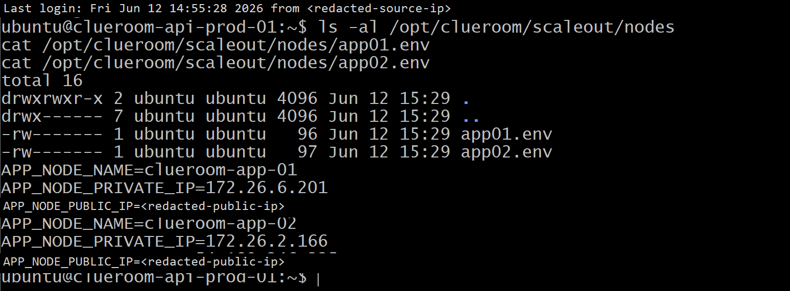
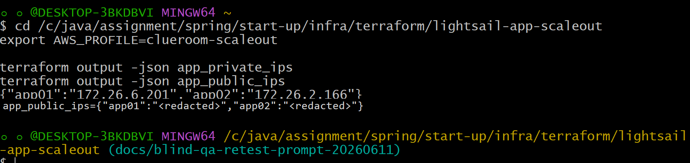
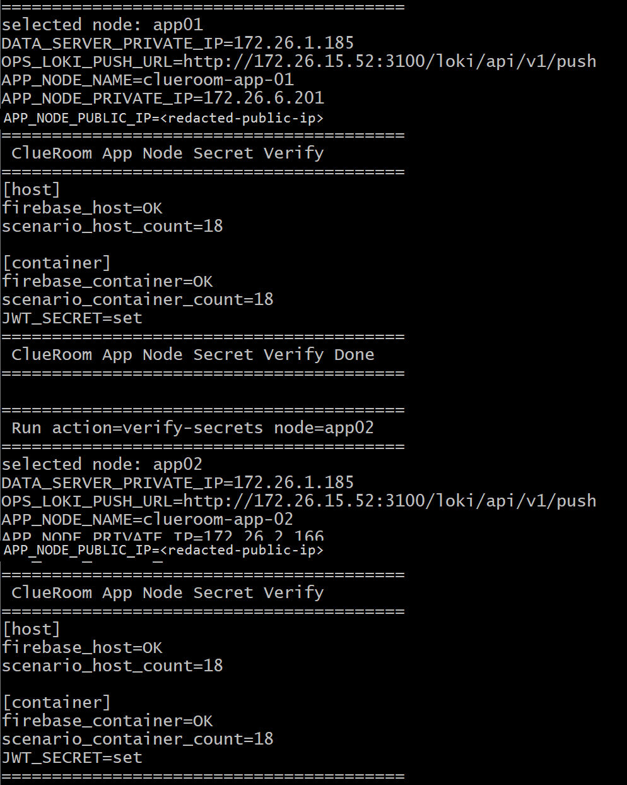
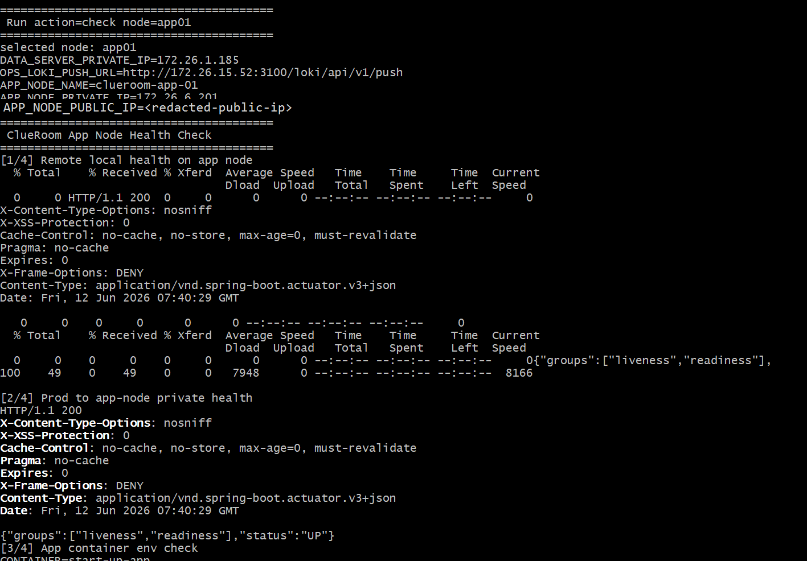
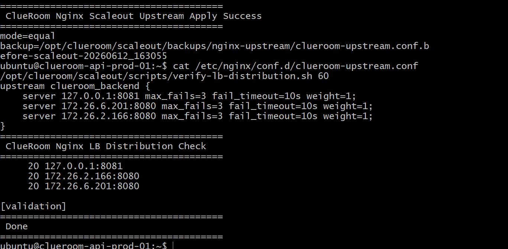
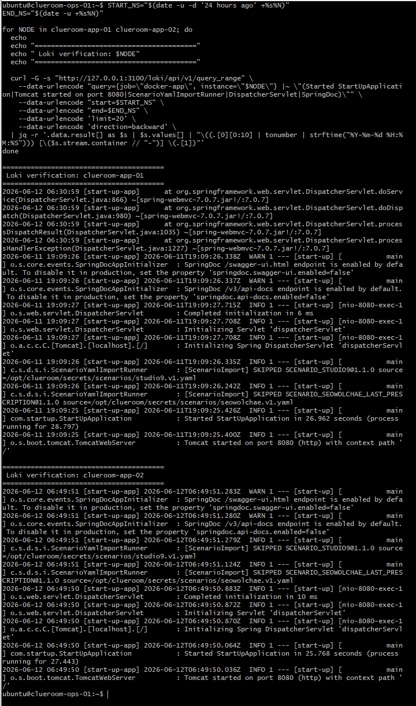
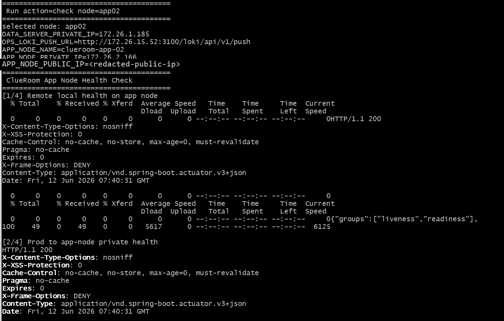
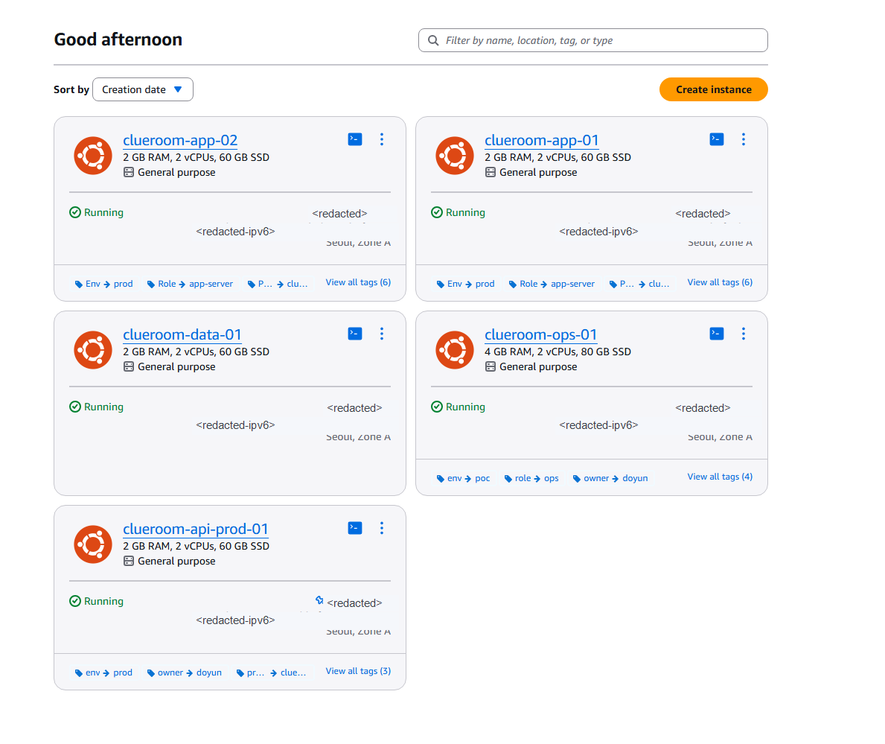

# POC-006. Terraform App Node Scale-out + Scripted Manual Nginx LB

## Status

Completed PoC on 2026-06-12.

This is not autoscaling and not the production baseline. It proves that ClueRoom can temporarily add app-layer nodes with Terraform and attach them through prod-controlled manual Nginx upstream changes.

## Verified Result

```text
Terraform created app01/app02
prod inventory managed app nodes
prod synced jar/env/secrets/scenarios to app nodes
app01/app02 started Spring Boot on port 8080
app01/app02 connected to data server MySQL/Redis
app node Alloy sent docker-app logs to ops Loki
Nginx upstream included local active + app01 + app02
equal mode 60 requests distributed 21 / 19 / 20
```

Verified equal-mode upstreams:

```text
127.0.0.1:8081
172.26.6.201:8080
172.26.2.166:8080
```

## PoC Evidence Screenshots

The screenshots below are public-safe copies of the 2026-06-12 PoC verification evidence. Public IPv4/IPv6 values and login/source IPs are redacted. Secret values, Firebase JSON contents, DB passwords, JWT values, and API keys are not included.

Private RFC1918 addresses remain visible where they are part of the already documented PoC routing evidence, such as app-node private upstreams and data/ops internal endpoints.

<details>
<summary>1. App node inventory generated on prod</summary>



</details>

<details>
<summary>2. Terraform output for app private/public IP maps</summary>



</details>

<details>
<summary>3. app01/app02 runtime secret and scenario verification</summary>



</details>

<details>
<summary>4. app01 health verification from prod control flow</summary>



</details>

<details>
<summary>5. Nginx equal-mode upstream and 60-request distribution</summary>



</details>

<details>
<summary>6. Loki startup log verification for app01/app02</summary>



</details>

<details>
<summary>7. app02 health verification from prod control flow</summary>



</details>

<details>
<summary>8. Lightsail console instance state during PoC</summary>



</details>

## Secret And Runtime Verification

The PoC verified that app01/app02 were not just shallow health responders:

```text
JWT_SECRET=set
Firebase service account file visible on host/container
scenario file count: 18
DB/Redis env pointed to the data server
```

No secret values, Firebase JSON contents, DB password, JWT value, or API keys are stored in this document.

## Nginx Bug Found And Fixed

An earlier upstream rewrite path produced a malformed local backend such as `127.0.0.1:80` or bare `127.0.0.1`. The valid local active backend is the Blue-Green app slot:

```text
127.0.0.1:8081
or
127.0.0.1:8082
```

The final apply/verify scripts guard against this by requiring the active local upstream port and failing distribution verification if `127.0.0.1:80` or bare `127.0.0.1` appears.

## What This Proves

- The app layer can run on separate Lightsail nodes.
- The app runtime can use shared data server MySQL/Redis.
- prod can control sync/start/check without storing secrets in the repository.
- ops Loki can collect app node logs through Alloy.
- Nginx can manually distribute traffic across local active and temporary app nodes.
- Rollback can return traffic to the local active Blue-Green slot.

## Limits

- This does not prove DB/Redis HA.
- This does not introduce AWS ALB, ASG, ECS, or managed autoscaling.
- This does not make app01/app02 the steady-state production baseline.
- This does not remove the need for manual rollback and Terraform cleanup.

## Repository Artifacts

| Path | Purpose |
|---|---|
| `scripts/scaleout/*.sh` | prod-controlled sync/start/check/Alloy/Nginx helper scripts |
| `infra/terraform/lightsail-app-scaleout/` | temporary Lightsail app node Terraform module |
| `docs/infra/runbook/SCALEOUT_MANUAL_LB_RUNBOOK.md` | operational runbook and rollback notes |

## Operational Decision

The PoC is successful. Keep the scripts and Terraform module as repeatable PoC/runbook artifacts, but keep the default production state on the existing prod/data/ops baseline unless the team explicitly decides to operate additional app nodes.
